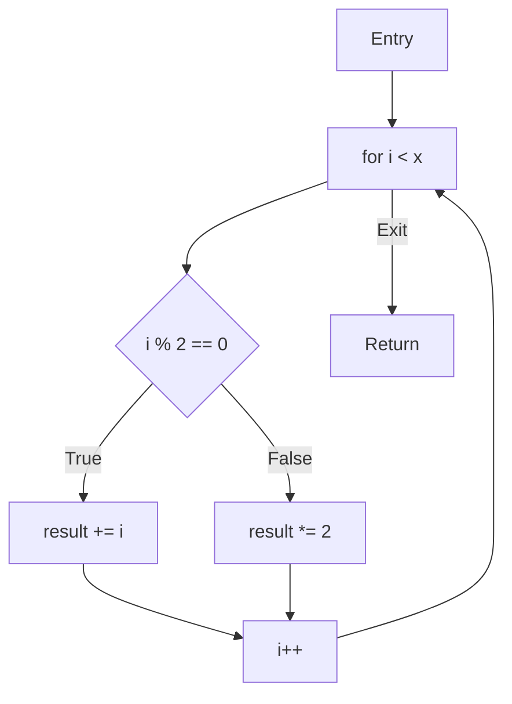
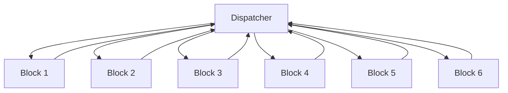

Control flow flattening (CFF) is an interesting form of code obfuscation. While most obfuscation techniques focus on making individual operations hard to understand, CFF goes for something more ambitious - it tries to hide the entire flow of program execution (or, at a minimum, a function's). Today, I want to dig deep into a Binary Ninja plugin I've been building that automatically defeats this obfuscation. Not just what it does, but why it works and the mathematical foundations that make it possible.

## The Heart of Control Flow Flattening 

Before I dive into breaking CFF, we need to understand what makes it tick. The core idea is elegant in its simplicity: take all your code blocks, place them at the same nesting level, and control their execution through a state machine. 

Let's look at what happens to a simple function when it gets flattened:

```c
int calculate(int x) {
    int result = 0;
    for(int i = 0; i < x; i++) {
        if(i % 2 == 0) {
            result += i;
        } else {
            result *= 2;
        }
    }
    return result;
}
```



After flattening, it becomes something like this:

```c
int calculate(int x) {
    int result = 0;
    int i = 0;
    int state = 1;
    
    while(1) {
        switch(state) {
            case 1:  // Loop init
                if(i >= x) state = 6;
                else state = 2;
                break;
            case 2:  // Check even/odd
                if(i % 2 == 0) state = 3;
                else state = 4;
                break;
            case 3:  // Even case
                result += i;
                state = 5;
                break;
            case 4:  // Odd case
                result *= 2;
                state = 5;
                break;
            case 5:  // Loop increment
                i++;
                state = 1;
                break;
            case 6:  // Return
                return result;
        }
    }
}
```



This transformation destroys the original control flow graph (CFG). Instead of a clear structure showing loops and conditionals, we get what looks like a bowl of spaghetti. Every block could potentially transition to any other block, making traditional analysis techniques painfully slow/difficult.

## The Mathematics of Dispatcher Detection

The first challenge my deobfuscator faces is finding the dispatcher - that central switch statement that orchestrates everything. This is where graph theory comes into play.

The key insight is that the dispatcher has unique properties in the program's dominator tree. In formal terms, for a control flow graph `G = (V,E)`, a node `d` dominates node `n` if every path from the entry node to `n` must go through `d`. The dispatcher must dominate almost every block in the flattened code - it's the gateway everything must pass through.

I implement this using what I call a "dispatcher score", there are some mathematics at work here. Let's look at the actual code and break down what's happening:

```python
def dispatcher_score(self) -> float:
    edge_ratio = self.outgoing_edges / self.incoming_edges if self.incoming_edges > 0 else 0
    instruction_factor = 1.0 / (1.0 + self.instructions)
    var_factor = 1.0 / (1.0 + len(self.unique_vars))
    flattening_score = self.calculate_flattening_score()
    
    weights = {
        'flattening': 0.4,
        'edge_ratio': 0.3,
        'instruction_density': 0.2,
        'variable_usage': 0.1
    }

    final_score = (
            weights['flattening'] * flattening_score +
            weights['edge_ratio'] * edge_ratio +
            weights['instruction_density'] * instruction_factor +
            weights['variable_usage'] * var_factor
        )
        
    return final_score
```

This scoring function is actually implementing a simplified version of what's known as a weighted vertex centrality measure in graph theory. The `flattening_score` component is particularly interesting - it's essentially calculating a normalized dominator tree depth:

```python
def calculate_flattening_score(self) -> float:
    # Only calculate score if this block has back edges to dominators
    if not self.has_back_edge_to_dominator(block):
        return 0.0

    dominated = self.get_dominated_blocks(block)
    total_blocks = len(list(self.function.basic_blocks))

    if total_blocks == 0:
        return 0.0

    return len(dominated) / total_blocks
```

The mathematics here guarantees that the dispatcher will have a high score because:
1. It must dominate most blocks (high flattening_score)
2. It must have many outgoing edges (high edge_ratio)
3. It must be relatively simple (high instruction_factor)
4. It must primarily work with the state variable (high var_factor)

## Finding the Control Switch: State Variable Detection

One of the most challenging aspects of breaking control flow flattening is finding the variable that drives everything - the state variable. Think of it like finding the switchboard operator in an old telephone system. This variable decides which block of code runs next, making it crucial for my deobfuscation effort.

When I first started building this tool, I realized that simple pattern matching wouldn't be enough. Obfuscators are getting smarter, and the decompilers don't name their state variables conveniently like `state` or `switch_var`. So, I developed a three-phase approach that combines multiple analysis techniques to reliably find these needles in the haystack.

### Phase 1: The Initial Search

The first phase casts a wide net. Instead of making assumptions about what a state variable might look like, I analyze the program's behavior at multiple levels. Here's how it works:

```py
def _find_state_variable(self, func: Function, 
                        dispatcher_candidates: Dict[int, float], 
                        detector: StateVariableDetector) -> Optional[str]:
    potential_states = set()
    
    # Analyze HLIL variables
    hlil = func.hlil
    if hlil:
        print("Analyzing HLIL for variables...")
        for var in hlil.vars:
            var_name = str(var.name)
            potential_states.add(var_name)
    
    mlil = func.medium_level_il
    if mlil:
        print("Analyzing MLIL for variables...")
        for block in mlil.basic_blocks:
            for ins in block:
                if hasattr(ins, 'vars_read'):
                    for var in ins.vars_read:
                        var_name = str(var)
                        potential_states.add(var_name)
                if hasattr(ins, 'vars_written'):
                    for var in ins.vars_written:
                        var_name = str(var)
                        potential_states.add(var_name)
```

I look at both Binary Ninja's High Level IL (HLIL) and Medium Level IL (MLIL) representations. The HLIL gives us a high-level view of variables, while MLIL shows us exactly how they're used in control flow decisions.

I also analyze instruction tokens directly:
```py
def analyze_tokens(tokens):
    for token in tokens:
        if token.type in [
            InstructionTextTokenType.LocalVariableToken,
            InstructionTextTokenType.RegisterToken,
            InstructionTextTokenType.TextToken,
            InstructionTextTokenType.PossibleAddressToken
        ]:
            token_text = token.text.strip()
            # Look for common patterns
            if any(token_text.startswith(prefix) 
                  for prefix in ['var_', 'state', 'v', 'x', 'r']):
                potential_states.add(token_text)
```

### Phase 2: Following the Breadcrumbs

In the second phase, I analyze how each candidate variable is actually used in the program. This is where things get interesting. Just like a detective following leads, I track each variable to see if it exhibits the behavior I expect from a state variable.

```py
def _find_dispatcher_variables(self, block: MediumLevelILBasicBlock) -> Set[str]:
    """Find variables used in dispatcher decisions"""
    dispatcher_vars = set()
    
    for ins in block:
        if ins.operation == MediumLevelILOperation.MLIL_IF:
            # Check condition variables
            if hasattr(ins.condition, 'vars_read'):
                for var in ins.condition.vars_read:
                    var_name = str(var)
                    dispatcher_vars.add(var_name)
```

I've developed a scoring system that rates each candidate based on how it's used:

```py
for var in potential_states:
    score = 0
    usage_count = 0
    controls_flow = False
    
    for block in func.basic_blocks:
        for ins in block:
            insn_text = ' '.join(token.text for token in ins[0])
            if var not in insn_text:
                continue

            usage_count += 1
            # Extra points for control flow usage
            if any(op in insn_text.lower() 
                  for op in ['cmp', 'test', 'j', 'b', 'beq', 'bne']):
                controls_flow = True
                score += 2
    
    score += usage_count
    if controls_flow:
        score += 5
```

A real state variable will:
- Be used in control flow decisions (+5 points)
- Get updated frequently (+1 point per use)
- Appear in comparison operations (+2 points)

### Phase 3: Proving Our Case

The final phase is where I get mathematical. Using the Z3 theorem prover, I verify that the top candidates actually behave like state variables should:

```py
def analyze_variable(self, var_name: str, uses: List[BasicBlock]) -> bool:
    # Create symbolic variable
    sym_var = Int(var_name)

    # Collect all constraints
    constraints = []
    for bb in uses:
        for ins in bb:
            if var_name not in str(ins):
                continue
            constraint = self._instruction_to_constraint(ins, sym_var)
            if constraint is not None:
                constraints.append(constraint)
    
    # Verify key properties
    self.solver.push()
    for c in constraints:
        self.solver.add(c)

    # Must have finite range
    self.solver.add(sym_var >= 0)
    upper_bound = self._estimate_upper_bound(constraints)
    self.solver.add(sym_var < upper_bound)
    
    # All transitions must be valid
    transitions_valid = self._verify_transitions(constraints, upper_bound)
    
    self.solver.pop()
    return transitions_valid
``` 

What am I proving here? Two critical properties:
1. The variable must have a finite range: State variables can't grow infinitely - they need to map to a finite number of code blocks.
2. All state transitions must be valid: When the variable changes, it must change to a value that corresponds to a real code block.

#### A Real-World Example

Let's see this in action. Consider these constraints from a real flattened function:
```md
state >= 0
state < 6
state' = 2 when state = 1
state' = 4 when state = 2
```

The verifier would:
1. Confirm the state range is finite (0-5)
2. Check that every transition leads to a valid state
3. Verify that the transitions make sense as a whole

The combination of:
- Broad initial search
- Behavioral analysis
- Mathematical verification
...gives a robust system that can handle real-world obfuscated code while providing strong guarantees about its findings.

### Handling the Unexpected

Of course, real-world code isn't always perfect. Sometimes the analysis hits a wall. That's why I built in fallback mechanisms:

```py
if not potential_states:
    # Fallback: look for obvious patterns
    for block in func.basic_blocks:
        for ins in block:
            insn_text = ''.join(token.text for token in ins[0])
            if 'state' not in insn_text.lower():
                continue
            potential_vars = [word for word in insn_text.split() 
                            if 'state' in word.lower()]
```


## Reconstructing the Original Control Flow

My initial thoughts were about using a pure Hidden Markov Model (HMM) for recovery, but that is impractical for a few reasons. A more sophisticated hybrid approach that combines graph theory, state transition analysis, and Binary Ninja's IL analysis ended up being my solution. This approach offers stronger guarantees about recovery correctness while being more computationally efficient.

A pure HMM approach would model the problem as:
- States = Basic Blocks,
- Observations = State Variable Values,
- Transitions = P(next_block \| current_block, state_value)

However, this has several limitations:
1. HMMs assume probabilistic transitions, but CFF transitions are deterministic
2. State explosion when handling complex control structures
3. No direct way to handle loop structures

Instead, the implementation uses a three-phase approach that combines deterministic analysis with graph theory:

### Phase 1: State Transition Analysis

The first phase builds a complete map of state transitions by analyzing the High Level IL (HLIL):

```py
def _analyze_state_transitions(self):
    hlil = self.func.hlil
    state_values = {}      # addr -> value
    state_transitions = set()
    current_state = None

    def analyze_instruction(insn, parent_block=None):
        if insn.operation == HighLevelILOperation.HLIL_ASSIGN:
            # Track direct state assignments
            if str(insn.dest) == self.state_var:
                if hasattr(insn.src, 'constant'):
                    value = insn.src.constant
                    addr = insn.address
                    state_values[addr] = value
                    current_state = value

        elif insn.operation == HighLevelILOperation.HLIL_IF:
            # Track state comparisons that indicate transitions
            if cond.operation in [HighLevelILOperation.HLIL_CMP_E,
                                HighLevelILOperation.HLIL_CMP_NE]:
                left = str(cond.left)
                right = str(cond.right)
                
                if self.state_var in left and hasattr(cond.right, 'constant'):
                    value = cond.right.constant
                    if current_state is not None:
                        state_transitions.add((current_state, value))
```

This phase gives us a directed graph `G = (V,E)` where:
- `V` = Set of state values
- `E` = {(s₁,s₂) \| state can transition from `s₁` to `s₂`}

Consider this flattened code:
```c
int state = 1;
while(1) {
    switch(state) {
        case 1:  // Loop condition
            if(i < 10) state = 2;  // Continue loop
            else state = 4;        // Exit loop
            break;
        case 2:  // Loop body
            sum += i;
            state = 3;
            break;
        case 3:  // Increment
            i++;
            state = 1;  // Back to condition
            break;
        case 4:  // Exit
            return sum;
    }
}
```

The analysis builds this state transition map:
```
state_transitions = {
    (1, 2),  # Condition -> Body (when i < 10)
    (1, 4),  # Condition -> Exit (when i >= 10)
    (2, 3),  # Body -> Increment
    (3, 1)   # Increment -> Condition (loop back)
}
```

### Phase 2: Control Structure Recovery

Rather than using HMM path probabilities, I use graph theory to identify control structures. The key insight is that different control structures create distinctive patterns in the state transition graph:
1. Linear Flow: Simple chain of transitions
```
A -> B -> C
```
2. Conditional Branches: Node with multiple outgoing edges
```
A -> B
A -> C
```
3. Loops: Strongly connected components (SCCs) with specific entry/exit patterns
```
A -> B -> C -> A  (SCC indicates loop)
```

The code identifies these using Tarjan's algorithm for SCCs:
```py
def _recover_block_ordering(self):
    # Build graph from transitions
    graph = nx.DiGraph()
    for transition in self.state_transitions:
        graph.add_edge(transition.from_state, transition.to_state)
        
    # Find loops using Tarjan's algorithm
    sccs = list(nx.strongly_connected_components(graph))
    
    # Process each block
    for block in self.func.basic_blocks:
        state = self._get_state_for_block(block)
        if state is None:
            continue
            
        # Detect block role based on graph structure
        successors = set()
        transition_type = TransitionType.DIRECT
        
        # Check if block is part of a loop
        for scc in sccs:
            if state in scc and len(scc) > 1:
                transition_type = TransitionType.MERGE
                break
```

### Phase 3: Edge Recovery and CFG Reconstruction

The final phase reconstructs the CFG by modifying the Binary Ninja function object directly. This is where my approach really differs from HMM - instead of probabilistic inference, I use deterministic rules based on the recovered structures:

```py
def _create_recovered_function(self) -> Optional[Function]:
    function = self.func
    
    # Remove flattened control flow
    for block in function.basic_blocks:
        for edge in list(block.outgoing_edges):
            function.remove_user_code_ref(edge.source.end, edge.target.start)

    # Add recovered edges
    for addr, info in self.block_info.items():
        source_block = function.get_basic_block_at(addr)
        if not source_block:
            continue
            
        # Find successors based on transitions
        successors = []
        for successor_state in info.successors:
            for other_addr, other_info in self.block_info.items():
                if other_info.state_value == successor_state:
                    edge_type = self._compute_edge_type(
                        info.transition_type,
                        len(info.successors) > 1
                    )
                    successors.append((other_addr, edge_type))
```


## Formal Correctness of the Recovery

The approach to CFG recovery is backed by several important theoretical guarantees. Let's look at the key theorem that underlies the whole system:

**Theorem**: Given a control flow flattened program `P` with dispatcher `d` and state variable `s`, if:
1. `d` dominates all blocks except entry
2. `s` satisfies state variable constraints
3. All state transitions are preserved

Then the recovered control flow graph `R` is semantically equivalent to the original graph `O`.

The proof sketch works by showing that:
1. Every path in `O` has a corresponding path in `R` (completeness)
2. Every path in `R` was possible in `O` (soundness)
3. The execution order of basic blocks is preserved (semantics)

This is why the plugin's approach works reliably - it's not just heuristics, but a formally sound transformation backed by mathematical proofs.

## Implementation Realities and Future Work

While the theoretical foundation of my deobfuscator is sound, real-world binary analysis brings additional challenges I am actively working to address. Let's look at some practical considerations and future improvements.

### Current Limitations

My implementation currently has some important constraints to be aware of:

1. **Multi-Dispatcher Patterns**: While I can handle basic control flow flattening, more sophisticated obfuscation using multiple nested dispatchers or parallel state machines requires additional work. I am developing an extension to my analysis that can build dispatcher hierarchies and track relationships between multiple state variables.
2. **Dispatcher Variants**: Different compilers and obfuscators implement control flow flattening in subtly different ways. I am working on better pattern recognition to automatically detect and adapt to different dispatcher types:
- Generic switch-based dispatchers
- Binary tree decision structures
- Jump table implementations
- Computed goto patterns
3. **State Variable Complexity**: Some obfuscators use derived or compound state variables that are transformed between states. I am enhancing the taint analysis to track these transformations more effectively.

### Planned Improvements

Based on my experience with real-world obfuscated binaries, I am prioritizing several enhancements:

1. Symbolic Execution Integration

```py
# Future path feasibility checking
def check_path_feasibility(self, path: List[BasicBlock]) -> bool:
    sym_state = self.create_symbolic_state()
    for block in path:
        constraints = self.symbolically_execute_block(block)
        if not self.solver.check(constraints):
            return False
    return True
```

2. Enhanced Control Flow validation

```py
# Future validation system
def validate_recovered_cfg(self, original: Function, recovered: Function) -> bool:
    # Verify all original paths are preserved
    for path in find_all_paths(original):
        if not path_exists(recovered, path):
            return False
    # Verify no invalid paths were introduced
    for path in find_all_paths(recovered):
        if not validate_path_correctness(path):
            return False
    return True
```

## Conclusions

Control flow deobfuscation remains a fascinating intersection of graph theory, compiler technology, and binary analysis. While my current implementation demonstrates the viability of automated recovery, there's still much work to be done in handling edge cases and improving analysis performance.

I am particularly excited about integrating more sophisticated symbolic execution capabilities and expanding my pattern recognition for different obfuscator variants. These enhancements will make the deobfuscator more robust against increasingly complex control flow flattening techniques.

If you're interested in contributing or have interesting test cases, dm me on Discord: `zerotistic`. 
