I got the occasion to give a small talk at an HackTheBox meetup in Paris on January 16th, 2024. The following are my slides.

The talk is mostly about why Binary Ninja is a viable option and what you could do with it. Sadly it was in Paris and thus in French. You'll find annotations under each slide.

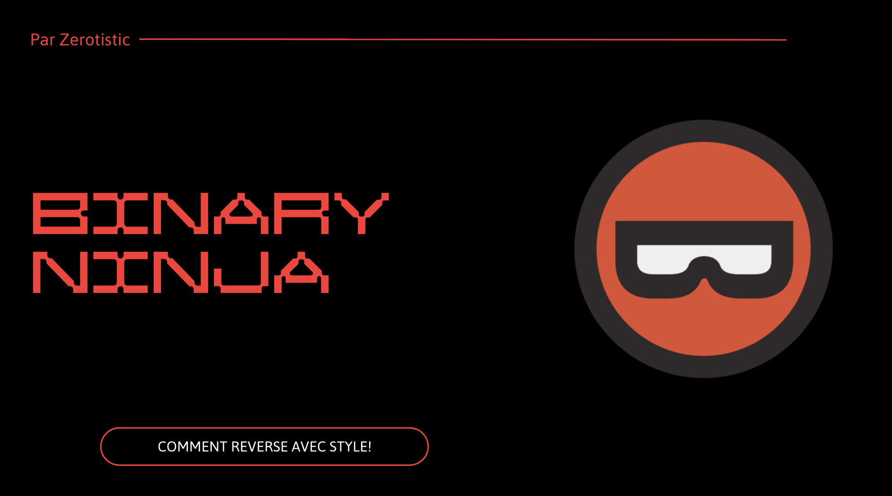
My objective is not to make you buy Binja at the end of the talk (but you should still do it ;) ) but more so you know it is a solid choice/option.

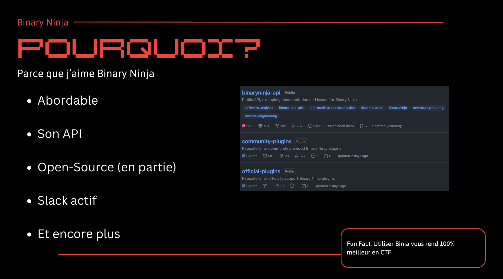
Price is more than affordable, API is **great**, partially open-source, active Slack and much more.

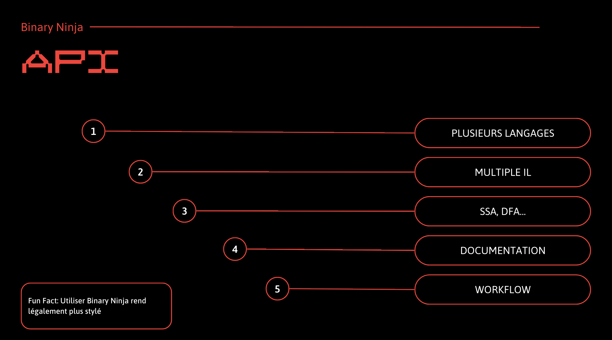
The API can be used in multiple languages, you can access all of Binja's IL, there is access to SSA/DFA/..., documentation is **great**, workflows (I'll talk about them later).

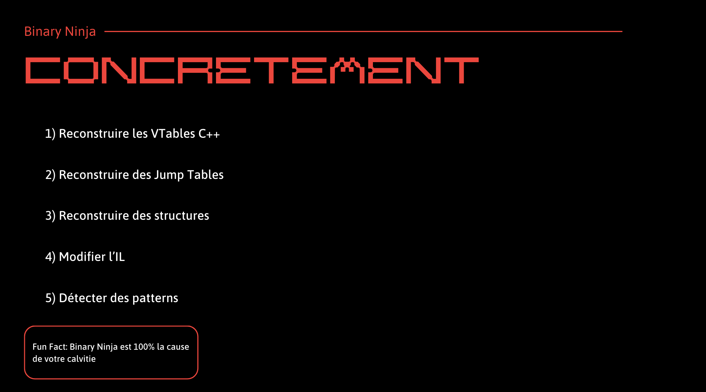
You could recreate C++ VTables, jump tables, structures, modify the IL or look for patterns.

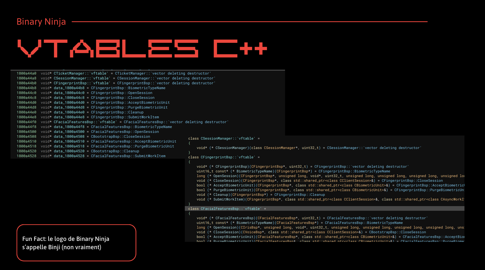
Showcase example of C++ vtables recovery.

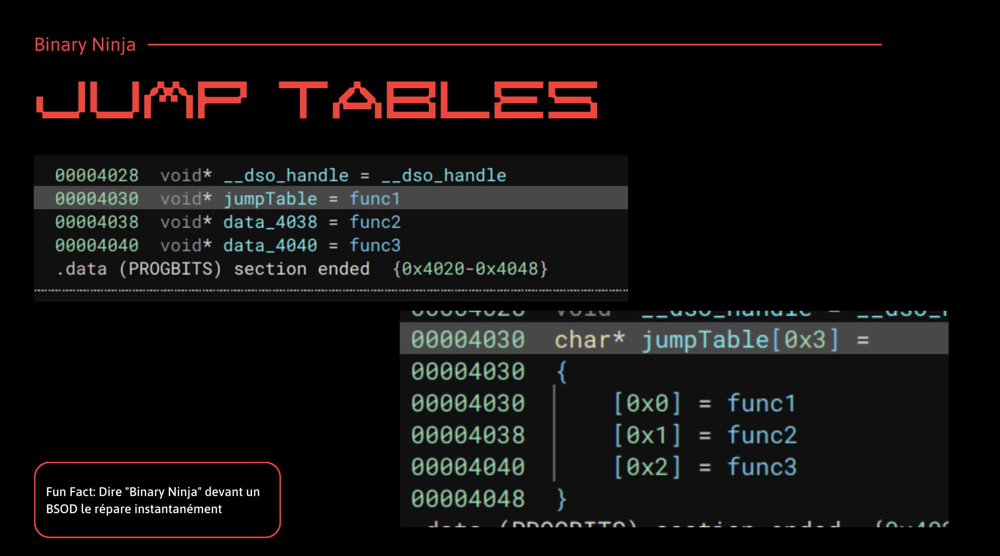
Showcase example of jump table.

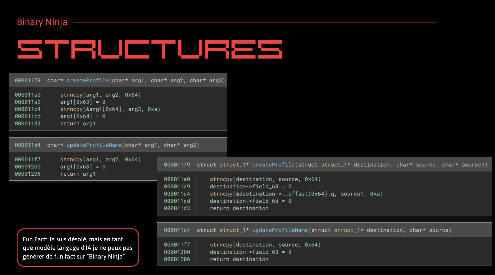
Showcase example of structure/fields recovery.

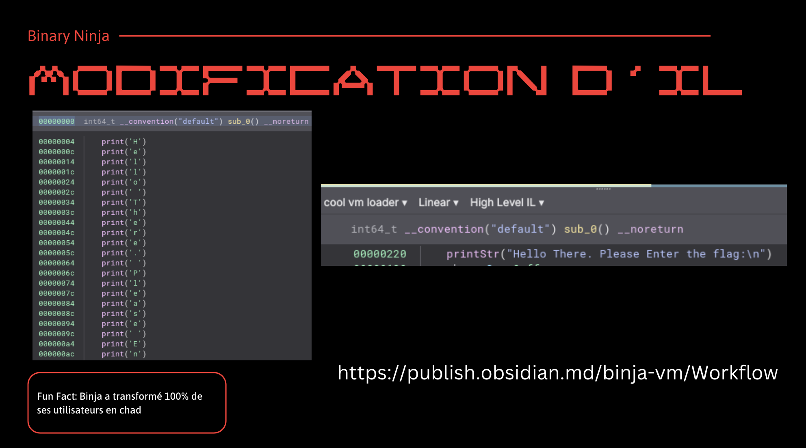
You can modify the decompilation analysis to clean up some code.

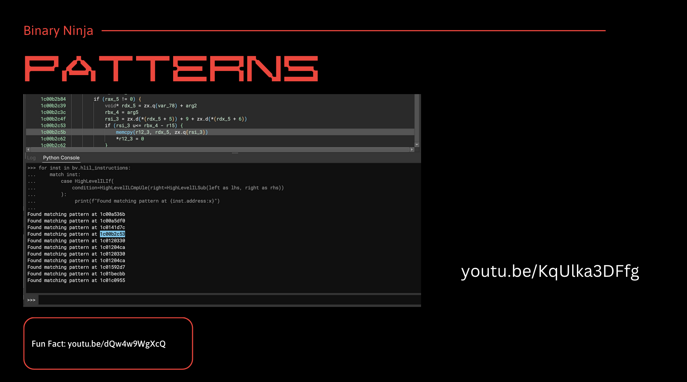
You can create models to find bugs.

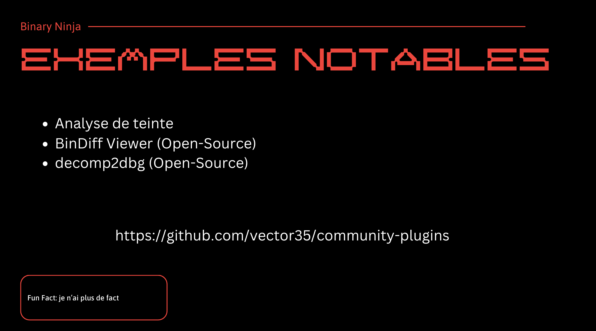
Some other cool works.

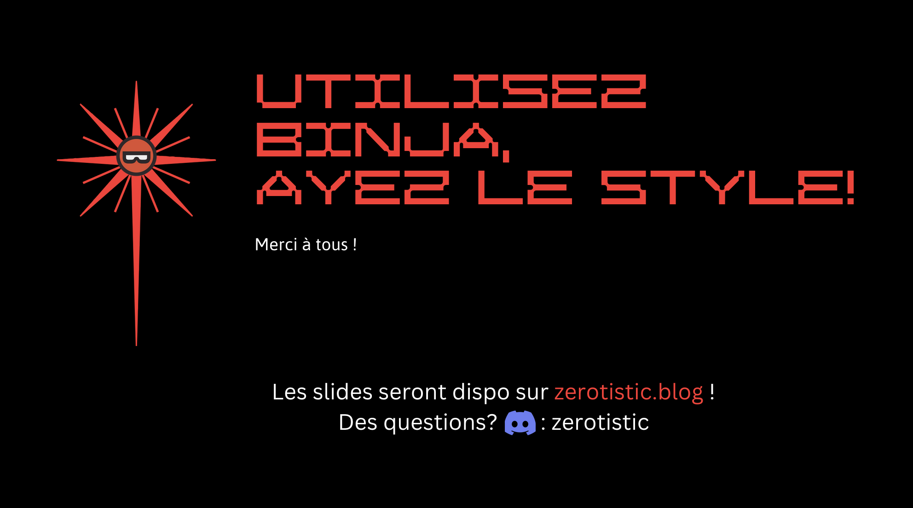
Thank you very much for listening.
