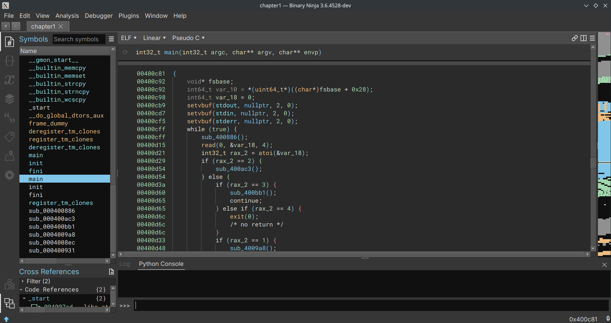
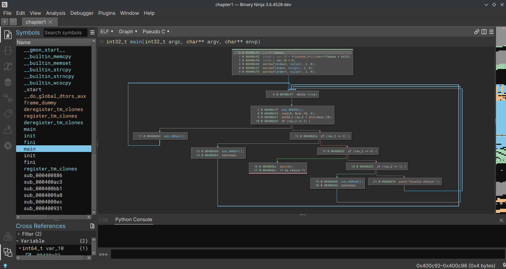

Welcome to the first post of the series `Binary Ninja: Zero to Hero`! This post is an introduction to Binary Ninja and an overview of its different components, more than a tutorial of any kind. It also serves as a teaser of what I'll write about and what skills you'll gain from this series. So let's get started!

## About Binary Ninja

Binary Ninja — from now on referred to as Binja — is developed by [Vector35](https://vector35.com/). Binja came to life around 6 years ago (writing this late 2023). It has numerous [open-source](https://github.com/Vector35/) components which make it very adaptable. Binja's adaptability is a key strength, as it allows a diverse range of plugins. This feature empowers users to tailor their analysis workflows according to their requirements. Furthermore, Binja benefits from a thriving open-source community that has actively [contributed numerous plugins](https://github.com/Vector35/community-plugins/).

Regular updates and ongoing development efforts further bolster Binja's reliability.

## Versions — Commercial / Personal / Enterprise

Binary Ninja comes in three versions: Non-commercial (Personal), Commercial, and Enterprise. The Non-commercial and Commercial versions use individual license files, while the Enterprise version uses a floating license system. This system allows licenses to be checked out from the Enterprise Server by any client for a specified duration.

The differences between Non-commercial and Commercial licenses are quite limited, encompassing just two distinctions: the ability to use them for commercial purposes and access to the headless API. In contrast, the Enterprise version not only offers these features but also includes Single Sign-On (SSO), Project Management capabilities, Floating licenses, and Access Control features.

One particularly appealing aspect of the licensing arrangement is that your payment covers a year of updates for Binja, rather than a year of usage. This means that when you make a payment you'll receive updates for a year, but you can continue using Binja beyond that period (although I strongly advise everyone to renew annually, given the numerous valuable updates available).

You can find more information [here](https://binary.ninja/purchase/).

## Overview

Binja is an extensive and intricate project, resulting in the development of numerous utilities and components. In this section I'll provide a broad overview of these components, without going into detailed explanations for each one. In forthcoming posts I'll go into specific use cases and provide a more comprehensive understanding of how these components operate and their practical applications.

### Decompiler

Primarily, at the heart of a decompiler's functionality is its ability to do precisely that: decompile code. It's a fundamental expectation, after all. Within Binja, users can traverse binary code interactively, accessing disassembled code while making annotations as required. Binja provides multiple views, including disassembly, LLIL, MLIL, HLIL, Pseudo-C, and SSA views. In forthcoming posts I'll go deeper into these views, and you'll come to appreciate their practical utility. At this stage it's not essential to go into the specifics of what each view offers. Typically, when starting, most users tend to primarily use disassembly and Pseudo-C views. These two perspectives provide a solid foundation for initial exploration and analysis.

_Example of the decompiler's view_

### Multi-architecture support

Another one of Binja's notable strengths lies in its extensive support for multiple architectures. It provides compatibility with a broad spectrum of architectures, including well-established ones like x86, ARM, MIPS, PowerPC, and many others. What's particularly noteworthy is that Binja goes beyond this list. In subsequent posts I'll go deeper into this aspect, but it's worth mentioning that it offers the capability to introduce support for new architectures through workflows and plugins. This feature proves exceptionally valuable for individuals engaged in tasks involving less common or emerging instruction sets, as well as those tackling Capture The Flag (CTF) challenges. A few examples include [Motorola 68k](https://github.com/galenbwill/binaryninja-m68k), [msp430](https://github.com/joshwatson/binaryninja-msp430), [Renesas M16C](https://github.com/whitequark/binja-m16c) or [Renesas V850](https://github.com/tizmd/binja-v850).

### Control Flow Graph

In the process of analyzing a function, understanding its flow is often crucial. Flow pertains to how the binary executes, depending on whether specific conditions are met or not. Binja offers a graphical representation of this control flow, which greatly facilitates tracking the execution path. This view serves multiple purposes, and a noteworthy example is the [Lighthouse](https://github.com/gaasedelen/lighthouse) plugin. Lighthouse is particularly valuable as it allows users to visualize the code coverage of a fuzzer on a binary.

_Example of the Control Flow Graph's view_

### Debugging

As one might expect, static analysis isn't always straightforward, and there are instances where you may require a debugger. Binary Ninja offers an integrated debugger, which is based on lldb and possesses significant capabilities. In fact, it recently received a substantial update with the implementation of Time-Travel Debugging (TTD), as detailed in the [3.5: Expanded Universe](https://binary.ninja/2023/09/15/3.5-expanded-universe.html#ttd-debugging) release notes. This debugger empowers users to perform a wide range of debugging tasks, essentially covering all the fundamental functions of a debugger and more, all from within the Binary Ninja environment.

### Plugins / Scripting

One of the notable strengths of Binja lies in its API, which is [well-documented](https://api.binary.ninja/) and accessible to users regardless of their license type. However, it's crucial to highlight a key distinction: while the personal license does not permit headless API usage, the commercial license does.

The API offers a wide range of capabilities, enabling users to perform tasks such as creating loaders, implementing support for various new architectures, aiding in pattern recognition, facilitating renaming and highlighting, and essentially accommodating any creative application one can conceive. There have been instances where the API has been employed to effectively [remove control flow flattening](https://www.lodsb.com/removing-control-flow-flattening-with-binary-ninja) from binaries.

In the future I'll be sharing numerous posts that go into the API's utility, particularly regarding its use in uncovering bugs, and assisting in reverse engineering and pattern detection.

### Bonus

- Binja supports custom UI themes, allowing anyone to customize their working environment.
- Binja supports the use of the [BinSync](https://github.com/binsync/binsync) plugin, a collaborative reversing tool built on the Git versioning system. This plugin allows for fine-grained reverse engineering collaboration across different decompilers.
- [Binary Ninja Cloud](https://cloud.binary.ninja/) is available for free, although there are some functional limitations (API, plugins, etc. are not available).

## Basic usage

In this section I'll showcase all of the major and basic utilities at your disposal, as well as give you their shortcut and tips if I have any. This can be anything from swiftly moving from one function to another to simply renaming a variable.

First and foremost, when it comes to reverse engineering, one of your initial tasks is renaming a variable, function, or structure. This process is relatively straightforward: simply right-click and choose "Rename Symbol", or use the shortcut `Ctrl+N`, which will prompt you to enter the new name. You can do the same for types, by selecting "Change Type" or using `Ctrl+Y`.

<iframe title="Function view before and after renaming" loading="lazy" frameborder="0" class="juxtapose" width="100%" height="736" src="https://cdn.knightlab.com/libs/juxtapose/latest/embed/index.html?uid=6906d860-5b93-11ee-b5be-6595d9b17862"></iframe>

_Function view before and after being renamed_

Much improved, wouldn't you agree? You might also observe that I've included a comment describing a variable as a "canary". To add such a comment, simply select one or multiple lines, then right-click and choose "Enter Comment", or use the `;` notation.

By the way, while I'm here, allow me to introduce you to the [0CD](https://github.com/0xb0bb/0CD) plugin. As stated in the readme, it's "a compilation of small quality-of-life enhancements frequently encountered in CTFs or similar toy problems". As far as my knowledge goes, it currently focuses on renaming canaries and retyping, and it's compatible only with Linux. In an upcoming blog post I plan to enhance its compatibility to encompass Windows and other architectures. For now I encourage you to install it as part of our next step: the installation of plugins.

Quickly before that though, let me show you how much nicer 0CD makes the canaries:

<iframe title="Canary annotations before and after using 0CD" loading="lazy" frameborder="0" class="juxtapose" width="100%" height="437" src="https://cdn.knightlab.com/libs/juxtapose/latest/embed/index.html?uid=6765b9da-5ba8-11ee-b5be-6595d9b17862"></iframe>

_Canaries before and after using 0CD_

Now, let's discuss how to install plugins. In this step we'll install 0CD so you can use it throughout this blog series. You have two options: select "Plugins" → "Manage plugins" or use the shortcut `Ctrl+Shift+M`. Regardless of your choice, after installation you'll need to restart Binary Ninja. You can do this by either closing the application and reopening it, or using the `Ctrl+P` shortcut, typing "Restart", and selecting it. The benefit of the second option is that it will restore all your previous work. Voilà! You installed your first Binja plugin.

Now that you've learned how to rename, retype, install plugins, and use shortcuts effectively, let's talk about another important feature: navigating between functions. Since you won't be concentrating solely on one function, you need the ability to move between functions seamlessly.

Binary Ninja offers a convenient way to do this. You can simply scroll up or down, and the view will transition to new functions as you scroll. However, if the function you're looking for is quite far away, you have two options:

- **Using the "Symbols" section:** Navigate to the "Symbols" section, where you can either scroll through the list or use the search function to find the specific function you want to jump to.
- **Using the `g` shortcut:** Press the `g` key, and a prompt will appear. Here you can enter the name or address of the function you wish to navigate to. This method allows for quick and precise navigation to a specific function, regardless of its location within the binary.

At this stage you should be comfortable with basic reversing and navigating through functions. However, you may find it beneficial to explore other views, such as the Graph view. Switching between views is straightforward. You can either select the dropdown list (usually located under the "Linear" label) and choose "Graph", or simply press Enter to toggle between views.

<iframe title="Binary Ninja linear and graph views" loading="lazy" frameborder="0" class="juxtapose" width="100%" height="643" src="https://cdn.knightlab.com/libs/juxtapose/latest/embed/index.html?uid=d649351a-5ba9-11ee-b5be-6595d9b17862"></iframe>

_Example of graph view_

With these fundamentals under your belt, you're well-equipped to dive into reverse engineering and pwn challenges using Binary Ninja! In the next part we'll explore additional plugins, go into different views such as the \*LIL and SSA, and unlock the full potential of Binary Ninja's UI with tools like the stack view, tags, and the memory map. Happy reversing and pwning!
