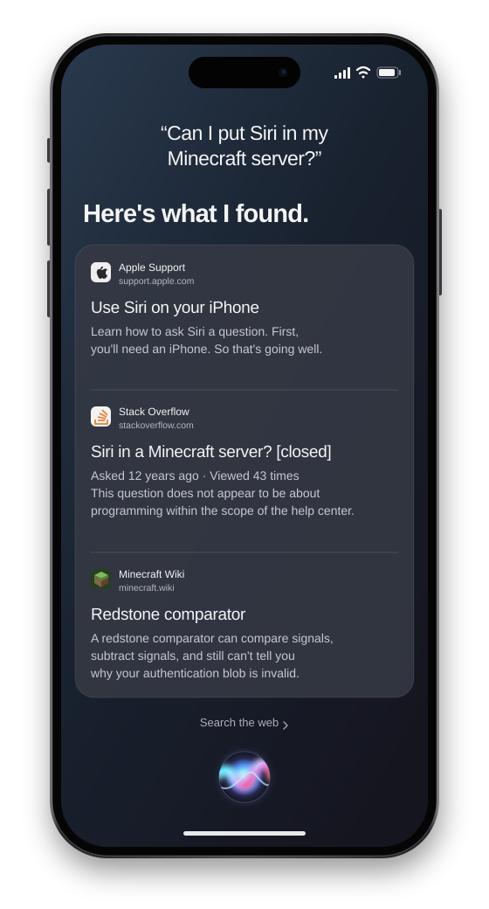

After finishing [the Find My People project](/posts/find-my-people-linux/), I wanted to add Siri to my Minecraft server. I'd chat with Siri and the questions would go from my Linux server to Apple, without an iPhone or Mac in the way. I mean why not right, who's going to stop me anyway?

```text
<Zerotistic> hey siri, what is 1000 divided by 64?
[Siri] It's 15.625.
```

I wanted whatever answer Siri actually returned, even if it was terrible (and it was often, I guess Siri really wasn't meant for a Minecraft server). Putting an LLM behind the bot and calling it Siri would have been easier, but that's not what I wanted to make.

To get there, I ended up working through Apple's **ACE** protocol and running some of its macOS authentication code in an emulator. Even after Siri accepted the session, getting an actual answer out of it was its own problem, because apparently receiving a successful response wasn't enough either.

This Siri client still uses extracted macOS code for authentication. I've since finished reversing the older NAC and ADI/Anisette code, including the white-box crypto, and got those working in pure Python, but that's a whole other story.

I'd hoped the code from my Find My client would save me some work, but that goes through MobileMe, SearchParty, IDS and APNs, while this Siri session uses ACE and worked without an Apple Account. So most of what I'd just finished wasn't useful here, and I was basically starting again.

The [Apple Wiki page about ACE](https://theapplewiki.com/wiki/Siri_Protocol), based on [Applidium's work from 2011](https://github.com/applidium/Cracking-Siri), gave me somewhere to start with its description of an iPhone 4S talking to `guzzoni.apple.com` through compressed binary plists. It wasn't enough to get a current session past its first command, though, which I guess is what happens after fifteen years of changes.

## Finding the code behind Siri

I started by looking for the code behind Siri's UI, which doesn't talk to Apple's server directly. That work goes through the background daemon `assistantd`, with `SiriCore.framework` handling the connection and byte framing and `SAObjects.framework` containing the commands sent over it.

Since `assistantd` is a normal universal Mach-O under `AssistantServices.framework`, I could extract its arm64e slice with `lipo`, but the other frameworks live in the macOS dyld shared cache, so I used [blacktop's `ipsw`](https://github.com/blacktop/ipsw) to get those out:

```bash
cache=/System/Volumes/Preboot/Cryptexes/OS/System/Library/dyld/dyld_shared_cache_arm64e

lipo -thin arm64e \
  /System/Library/PrivateFrameworks/AssistantServices.framework/Versions/A/Support/assistantd \
  -output assistantd.arm64e

ipsw dyld extract "$cache" \
  /System/Library/PrivateFrameworks/SiriCore.framework/Versions/A/SiriCore

ipsw dyld macho "$cache" \
  SiriCore --objc > SiriCore.objc.txt
ipsw dyld macho "$cache" \
  SiriCore --symbols > SiriCore.syms.txt
```

I used macOS 26.6.2, build `25G83`, so the addresses below belong to that exact build and aren't meant to carry over to whichever version you happen to have.

The Objective-C metadata immediately gives useful names:

```text
+[SiriCoreAceSerialization dataForObject:error:]
+[SiriCoreAceSerialization dataForPing:]
+[SiriCoreAceSerialization dataForStreamHeaderWithCompressionType:]
+[SiriCoreAceSerialization tryParsingAceHeaderData:compressionType:bytesRead:error:]
+[SiriCoreAceSerialization tryParsingPacketWithBytes:length:rawPacket:object:bytesRead:error:]

-[SiriCoreSiriBackgroundConnection _headerDataForURL:aceHost:languageCode:syncAssistantId:]
-[SiriCoreSiriBackgroundConnection _consumeAceDataWithData:bytesRead:error:]
```

Having those names and addresses saved me from identifying everything in raw assembly, so I could start at `_headerDataForURL:...`, follow the response into `_consumeAceDataWithData:...`, and work through the serializer methods one by one.

## Finding a request Apple would accept

Apple still lists `guzzoni.apple.com` as the host for Siri and dictation, so I started poking it with normal HTTP requests, though it didn't have much to say:

```console
$ curl --http2 https://guzzoni.apple.com/
404 Not found

$ curl --http2 https://guzzoni.apple.com/ace
406 Not Acceptable

$ curl --http2 -X POST https://guzzoni.apple.com/ace
406 Not Acceptable
```

After getting `406` no matter which headers or content types I tried, I went back to the wiki and noticed that Applidium's client used a method called `ACE` instead of `GET` or `POST`. Even that failed over HTTP/1.1, so I tried it over HTTP/2 and finally got something different:

```console
ACE /ace over HTTP/1.1 -> 400 Bad Request
ACE /ace over HTTP/2   -> 200
response body          -> aa cc ee 02
```

So yeah, `ACE` is literally the method name, which HTTP/2 lets me put in the `:method` pseudo-header. Apple's front end apparently wasn't happy with the same value in an HTTP/1.1 request line, despite accepting it here.

Because the request stays open in both directions for the whole Siri session, I used Python's low-level `h2` library since the normal HTTP clients really want to finish uploading a request before they start handing the response back.

This is the complete initial header set needed by my client:

```python
headers = [
    (":method", "ACE"),
    (":scheme", "https"),
    (":authority", "guzzoni.apple.com"),
    (":path", "/ace"),
    ("user-agent",
     "Assistant(MacBookPro/MacBookPro18,3; "
     "Mac OS X/26.6.2/25G83) Ace/13.0-20A"),
    ("accept-language", "en-US"),
    ("content-length", "2000000000"),
]
```

That stupid two-billion-byte content length comes from the native client, and since the stream doesn't have a known final size, it's basically telling the server that the body isn't finished yet. Beyond negotiating `h2` with ALPN, I didn't need any special TLS setup, a client certificate or even a `Content-Type`.

Once Apple returned HTTP `200` followed by `AA CC EE 02`, I could finally move on from the transport and figure out what those four bytes actually meant.

## Recovering the ACE framing

Although the old documentation calls the whole `AA CC EE 02` value a magic number, decompiling `+[SiriCoreAceSerialization dataForStreamHeaderWithCompressionType:]` showed it's really three fixed bytes followed by an argument:

```asm
mov   w8, #0xee
sturb w8, [fp, #-0x2]      ; byte 2 = EE
mov   w8, #0xccaa
sturh w8, [fp, #-0x4]      ; bytes 0..1 = AA CC
sturb w2, [fp, #-0x1]      ; byte 3 = caller's compression type
```

The parser does the same thing in reverse and only compares the first three:

```asm
ldrh  w8, [sp, #0xc]
ldrb  w9, [sp, #0xe]
mov   w10, #0xccaa
cmp   w8, w10
mov   w8, #0xee
ccmp  w9, w8, #0, eq
```

Current clients pass `2` there, and tracing `SiriCore`'s only compressor, `SiriCoreZlibDataCompressor`, led me to `deflate`, giving me this layout for the bytes after the header:

```text
AA CC EE 02 | zlib(packet | packet | packet ...)
```

Inside that zlib stream, every packet starts with a type byte followed by a four-byte big-endian value, whose meaning depends on the type: a body length for plist and speech packets, or a sequence number for ping and pong. Following the cases in `tryParsingPacketWithBytes:...`, I found `00` for no-op, `02` for a plist, `03` for ping, `04` for pong, `07` for speech and `ff` for the end marker.

The native ping builder makes the endianness visible:

```asm
mov   w8, #0x3
sturb w8, [fp, #-0x5]      ; type = ping
rev   w8, w2               ; reverse the 32-bit sequence number
stur  w8, [fp, #-0x4]
mov   w1, #0x5             ; packet size
```

With that figured out, the Python codec was only a few lines:

```python
ACE_MAGIC = b"\xaa\xcc\xee"

def stream_header(compression=2):
    return ACE_MAGIC + bytes([compression])

def encode_packet(packet_type, value=0, body=b""):
    if packet_type in (0x02, 0x07):
        value = len(body)
    return struct.pack(">BI", packet_type, value) + body

def parse_packet(data):
    if len(data) < 5:
        return None, 0
    packet_type, value = struct.unpack_from(">BI", data)
    if packet_type not in (0x02, 0x07):
        return (packet_type, value, b""), 5
    if len(data) < 5 + value:
        return None, 0
    return (packet_type, value, data[5:5 + value]), 5 + value
```

The connection uses a single zlib stream, so I kept the same compressor for all packets and called `Z_SYNC_FLUSH` after each one to send the buffered data. Without that flush, zlib could hold onto a command instead of sending it to Siri.

```python
raw = encode_packet(0x02, body=plist_bytes)
wire = deflater.compress(raw) + deflater.flush(zlib.Z_SYNC_FLUSH)
h2.send_data(stream_id, wire, end_stream=False)
```

Siri replies with the same framing, but HTTP/2 can split those bytes wherever it wants, including halfway through an ACE header. The decoder therefore keeps whatever's incomplete and tries again when another DATA frame arrives.

## Turning plists into commands

Packet type `02` contains a binary property list, or plist, which is basically Apple's binary encoding for dictionaries, arrays, strings, numbers and byte strings. To turn that into an ACE object, there's also a class and group telling the other side which command the dictionary represents.

The old object layout nested command properties:

```json
{
  "class": "LoadAssistant",
  "group": "com.apple.ace.system",
  "properties": {
    "language": "en-US"
  },
  "aceId": "...",
  "v": "1.0"
}
```

Sending that old shape wasn't quite right either, because modern `Ace/13.0-20A` clients moved the properties into the top-level dictionary and renamed the two metadata keys:

```json
{
  "$class": "LoadAssistant",
  "$group": "com.apple.ace.system",
  "aceId": "...",
  "language": "en-US",
  "deviceAuthVersion": 1,
  "sessionValidationData": "<NSData>"
}
```

When I sent the flat object as `Ace/1.0`, Apple gave me error 712 and asked for the old format but changing it to `Ace/13.0-20A` made it work.

Since I needed more than just `LoadAssistant`, manually copying command names and fields from the decompiler would've been miserable. Luckily, `SAObjects.framework` has an Objective-C class for every ACE command, with instances that answer `groupIdentifier` and `encodedClassName`, so I could load the framework and ask them:

```python
ctypes.CDLL("/System/Library/PrivateFrameworks/SAObjects.framework/SAObjects")

for cls in objc.getClassList():
    if not cls.instancesRespondToSelector_("groupIdentifier"):
        continue
    if not cls.instancesRespondToSelector_("encodedClassName"):
        continue
    try:
        instance = cls.alloc().init()
        group = str(instance.groupIdentifier())
        wire_name = str(instance.encodedClassName())
    except Exception:
        continue
```

Merging in the property types from `ipsw dyld macho ... --objc` gave me a registry of 1,467 classes, 72 groups and 4,617 properties. I couldn't derive the wire name from the Objective-C name reliably either: `SASFinishSpeech`, for example, becomes `FinishSpeech`, while plenty of other classes follow different prefix rules.

I didn't want to trust an encoder just because my decoder could read its output, so one test passes a Python-generated plist into Apple's own `+[AceObject aceObjectWithPlistData:]`. Apple turns it into an `SALoadAssistant`, and every field comes back with the value I sent.

At this point I could connect and encode commands correctly, but Siri still rejected the first useful one because I had no idea what to put in `sessionValidationData`.

## Following authentication through assistantd

Going back to `assistantd`, I followed the class that sets up a server session, `ADSessionRemoteServer`, whose method names were nice enough to describe most of the authentication flow even though the code underneath was stripped and obfuscated:

```text
_startSession
_continueAuthentication
_sendGetSessionCertificateData
_saGetSessionCertificateResponse:
_continueAuthWithCertificateData:
_sendCreateSessionInfoRequestWithData:
_saCreateSessionInfoResponse:
_persistValidationData:withExpiration:
_continueSessionInitWithValidationData:
_sendLoadAssistantWithAccount:validationData:
_saAssistantLoaded:
```

The log strings `Sending request for certificate data` and `Got context %p from NACInit` gave me somewhere to start, but finding their references was weirdly annoying because the tools disagreed about the Mach-O layout. Since ARM64 normally addresses strings through an `ADRP`/`ADD` pair, I wrote a tiny scanner to find those references myself:

```python
if insn & 0x9f000000 == 0x90000000:       # ADRP Xn, page
    pages[register] = (pc & ~0xfff) + immediate

if insn & 0xffc00000 == 0x91000000:       # ADD Xd, Xn, imm12
    page = pages.get(source)
    if page is not None and page + immediate == string_address:
        references.append(pc)
```

Following those references and the Objective-C messages around them gave me this simplified version of Apple's flow:

```c
send(GetSessionCertificate(deviceAuthVersion));

onGetSessionCertificateResponse(response) {
    request = authenticator.init(response.certificate);
    send(CreateSessionInfoRequest(request, deviceAuthVersion));
}

onCreateSessionInfoResponse(response) {
    authenticator.keyEstablishment(response.sessionInfo);
    validationData = authenticator.sign(NULL, 0);
    cache(validationData, response.validityDuration);
    send(LoadAssistant(validationData, assistantId, speechId));
}
```

I tested the validation field separately to make sure I wasn't chasing some unrelated setup problem:

```text
no sessionValidationData      -> SessionValidationFailed(InvalidValidationData)
random non-empty bytes        -> SessionValidationFailed(InvalidFingerprint)
valid current output          -> AssistantLoaded(requestSync = true)
```

So Apple supplies both halves of the challenge, but the client still has to run its private `authenticator` and produce a fingerprint Siri accepts.

## The wrong Absinthe

Apple calls this device-validation system Absinthe, which I'd already run into while working on IDS. Existing projects emulate an older version using Apple's extracted `NACInit`, `NACKeyEstablishment` and `NACSign` functions, so seeing the same three stages in Siri made me hope I could reuse that code for once.

The first authentication step succeeded, but Siri rejected the resulting validation blob for some fucking reason. I'd thought finishing just one step would make the whole thing work but life ain't so easy.

Looking back at the class that creates the authenticator, I found that the old code implements Absinthe/NAC strategy 2, while current Siri asks for `ADDeviceAuthenticationSessionV1`. Despite its lower version number, that class uses a newer FairPlay SAP implementation, which produced 501 bytes in native Siri compared to the older implementation's 389.

So the old NAC emulator was a dead end, but at least the implementation Siri wanted was statically linked into the `assistantd` binary I already had.

## Running the FairPlay code on Linux

This is where it got slightly cursed, because the Objective-C wrapper eventually reaches three stripped C functions that I named after what it uses them for:

```python
SAP_CREATE   = 0x100229840
SAP_EXCHANGE = 0x100193660
SAP_SIGN     = 0x1001df834
```

After getting a context from `SAP_CREATE`, the wrapper calls `SAP_EXCHANGE` with Siri's certificate and then again with the returned session info, before passing a null pointer and length zero to `SAP_SIGN` to produce the blob for `LoadAssistant`.

Being arm64e, these functions were already the wrong architecture for my Linux server, but I also had to deal with Pointer Authentication Codes (PAC), which arm64e uses to sign return addresses and indirect branch targets. A homemade loader doesn't install pointers with valid Apple signatures, so instructions such as `blraa x16, x17` can't use them.

I patched the authenticated instructions into their normal ARM64 equivalents before giving the image to Unicorn:

```python
HINT_REWRITES = {
    0xD503233F: 0xD503201F,  # paciasp -> nop
    0xD503237F: 0xD503201F,  # pacibsp -> nop
    0xD50323BF: 0xD503201F,  # autiasp -> nop
    0xD50323FF: 0xD503201F,  # autibsp -> nop
    0xD65F0BFF: 0xD65F03C0,  # retaa   -> ret
    0xD65F0FFF: 0xD65F03C0,  # retab   -> ret
}

# BLRAA Xn, Xm -> BLR Xn
if word & 0xFFFFFC00 == 0xD73F0800:
    rn = (word >> 5) & 0x1f
    replacement = 0xD63F0000 | (rn << 5)
```

Since I'm loading the binary and replacing its imports myself, there isn't a useful signature for PAC to verify inside the emulator anyway. Removing that pointer integrity check leaves the FairPlay calculation itself in place.

Of course, stripping PAC still didn't make the binary load, because its `LC_DYLD_CHAINED_FIXUPS` stores pointers as packed records containing a target and the distance to the next record. Before starting Unicorn, I had to walk those chains and replace the records with real rebased pointers:

```python
for fixup in walk_chained_fixups(data, image):
    if fixup.kind != "rebase":
        continue
    struct.pack_into("<Q", patched_image, fixup.file_offset, fixup.target)
```

For bind records, the target is an imported symbol number, so I replaced each one with a tiny Darwin shim or a named trap. As execution reached memory functions, locks, SHA-1/SHA-256, randomness, time, `pthread_once` and a few system queries, I logged the return address and all eight argument registers whenever an import wasn't implemented yet. Most of the work became a fairly boring loop of “run it, see the next missing function, implement enough of it, repeat”.

Each call starts with a fresh emulated stack, puts its arguments in `x0` through `x7`, and uses a fake return address so I know whether it came back normally:

```python
def call(self, address, arguments):
    self.uc.reg_write(UC_ARM64_REG_SP, STACK_TOP)
    self.uc.reg_write(UC_ARM64_REG_FP, STACK_TOP)
    self.uc.reg_write(UC_ARM64_REG_LR, STOP_ADDRESS)

    for index, value in enumerate(arguments):
        self.uc.reg_write(ARM64_ARGUMENT_REGISTERS[index], value)

    self.uc.emu_start(
        address,
        STOP_ADDRESS,
        timeout=30_000_000,
        count=100_000_000,
    )
```

After taking WSL down enough times during the other Absinthe experiments, I gave code, data, stack, heap, import traps and thread-local storage their own fixed-size ranges, capped inputs and outputs at one MiB, and added an instruction limit and timeout to every call. If it crashes or doesn't reach `STOP_ADDRESS`, I get the fault and the last basic blocks it executed, which is considerably more useful than taking everything down with it again.

Once the runtime could execute all three entry points, the Python adapter was basically the same sequence I had recovered from the Objective-C wrapper:

```python
def init(self, certificate):
    self._reset_runtime()
    self.context = sap_create()
    return sap_exchange(self.context, certificate)

def key_establishment(self, session_info):
    self.completion = sap_exchange(self.context, session_info)

def sign(self):
    return sap_sign(self.context, data=None, length=0)
```

I still didn't know if emulating the code would be enough. If SAP needed a secret from real Mac hardware, the whole Linux idea was dead, so I logged every system query and IOKit call it made. Weirdly, the working path never asked for a serial number, `hw.machine`, `hw.model` or `kern.osversion`. It only queried `kern.hv_vmm_present`, which a physical Mac reports as a 32-bit zero, and left its 24-byte hardware-info output empty. It didn't need a successful IOKit call either.

After all that stuff the emulator returned 501 bytes and Siri replied with `AssistantLoaded` instead of `InvalidFingerprint`. It was the first fully authenticated Siri session I had managed from Linux. Is that cool? Idk you tell me but I find it cool.

What's running here is Apple's macOS FairPlay SAP V1 machine code under Unicorn, so I haven't reimplemented all of FairPlay and this isn't an iOS NAC credential.

I also tried an iPhone-looking User-Agent and matching outer device fields with the same Mac SAP output:

```text
Assistant(iPhone/iPhone15,2; iPhone OS/26.6/23G71) Ace/13.0-20A
```

That authenticated too, which suggests those outer platform strings aren't bound to the SAP result in this Siri flow. It doesn't magically make the credential an iOS one, though, because the 501 bytes still came from the macOS implementation.

## Loading and synchronizing the assistant

There was still some setup between getting `AssistantLoaded` and having Siri answer anything, starting with the three client-generated UUIDs and 501-byte validation blob included in `LoadAssistant`:

```python
AceObject(
    "LoadAssistant",
    "com.apple.ace.system",
    assistantId=assistant_id,
    loggableAssistantId=logging_assistant_id,
    speechId=speech_id,
    language="en-US",
    deviceAuthVersion=1,
    sessionValidationData=validation_data,
)
```

When Apple returned `AssistantLoaded` with `requestSync` set and pushed `GetAssistantData`, I answered with the locale, time zone, OS version, device model and a bunch of empty capability/restriction fields, after which it asked for the normal Siri data synchronization:

```text
Siri -> GetAssistantData
     <- SetAssistantData
     <- Sync.GetAnchors
Siri -> Sync.GetAnchorsResponse
     <- Sync.Finished
```

I'd first ignored synchronization because I only cared about text and didn't have anything to sync, leaving me with an authenticated connection where every question went nowhere. Sending the empty anchor state and `Sync.Finished` finally got text requests moving, so the client waits for that to finish before reporting the session as ready.

During setup, Siri sends `SetConnectionHeader` with a value called `aceHostHeader`. That value has to come back as the `X-Ace-Host` HTTP header on the next connection which I'd originally been putting a random UUID there because I didn't know the server assigned it.

Keeping the connection alive had another small annoyance: Siri uses both an ACE object called `Ping` and raw type-`03` packets. They're separate ping formats, so the client has to answer each one with its matching pong.

## Sending a text request

With the assistant authenticated and synchronized, I went back to `SAObjects` to figure out how to send typed text and found a pair of commands in the request-dispatch group. They split the job between `StartServerRequest`, which opens the turn, and `ExecuteNLOnServer`, which carries the sentence:

```python
request_id = new_ace_id()
candidate_id = new_ace_id()

send(AceObject(
    "StartServerRequest",
    "com.apple.ace.requestdispatch",
    ace_id=request_id,
    textRequest=True,
    turnId=new_ace_id(),
    inputOrigin="AssistantTextInput",
    origin="AssistantTextInput",
    textToSpeechIsMuted=True,
))

send(AceObject(
    "ExecuteNLOnServer",
    "com.apple.ace.requestdispatch",
    ref_id=request_id,
    resultCandidateId=candidate_id,
    utterance="what is the weather in Paris",
    requestType="TEXT",
    aceDelegatedUserDialogActList=[],
))
```

There were a few lovely ways to make this fail without an error, including getting the case of `TEXT` wrong in `requestType`, leaving out the empty `aceDelegatedUserDialogActList`, or sending both commands immediately after each other. Since the native client dispatches them separately, I tried a 250 ms delay between them, which worked consistently for me.

Even then, Siri didn't give me the final answer directly, sending a `FlowOutputCandidate` with a candidate ID and nested ACE commands that I had to accept with `ResultCandidateSelected`:

```python
if obj.wire_name == "FlowOutputCandidate":
    selected = obj.properties.get("resultCandidateId")
    send(AceObject(
        "ResultCandidateSelected",
        "com.apple.ace.requestdispatch",
        ref_id=request_id,
        selectedResultCandidateId=selected,
        serverFallback=True,
    ))
```

Inside the candidate I finally got `AddViews` and `RequestCompleted`, with the useful answer in `AssistantUtteranceView.text`, which holds what Siri would display or say. There's also `UserUtteranceView.text` if I want to know what it thought I'd asked.

## "Here's what I found" is a shit answer

Weather and arithmetic worked immediately after that, but other questions just printed `Here's what I found.` and absolutely nothing else. Siri clearly had some sort of result, so I looked through the `AddViews` payload and found a second view next to the useless sentence:

```text
AssistantUtteranceView.text = "Here's what I found."
Snippet.cardData             = <binary data>
```

The result was hiding in `cardData` as a SearchFoundation `_SFPBCard`, which turned out to be protobuf embedded inside the binary plist. Looking through the matching SearchFoundation classes gave me the fields for the basic web-result card:

```text
_SFPBCard.cardSections                                      field 3
_SFPBCardSection.value                                      field 2
_SFPBCardSection.resultIdentifier                           field 7
_SFPBCardSectionValue.rfSimpleItemRichSearchResultCard...   field 202
rich result title / summary / source                        fields 1 / 2 / 3
```

I only decode the card shape I'd actually seen, leaving unknown cards in the raw response instead of guessing what every SearchFoundation type means. Since it's still untrusted data from the network, even if Apple sent it, the parser checks lengths and varints and caps the total card size and field count.

```python
for section_data in card.byte_values(3):
    section = ProtoMessage.parse(section_data)
    url = result_url(section.byte_values(7))

    for value_data in section.byte_values(2):
        value = ProtoMessage.parse(value_data)
        for result_data in value.byte_values(202):
            results.append(decode_rich_result(result_data, url))
```

With that parser, this:

```text
Here's what I found.
```

turned into the title, summary, source and URL Siri had returned, letting me show the first complete summary without its link whenever there isn't a real spoken answer to use. Some Minecraft questions still get mediocre web snippets, and while feeding those through an LLM could make them nicer, it'd also mean the LLM was answering and the entire premise would be bullshit.

<div class="siri-phone-illustration">



<svg class="siri-phone-clock" viewBox="0 0 560 1040" aria-hidden="true"><text x="104" y="90" fill="#f5f5f7" font-family="-apple-system, BlinkMacSystemFont, 'Helvetica Neue', Arial, sans-serif" font-size="17" font-weight="600">9&#58;41</text></svg>

</div>

## The client and the Minecraft demo

After all of that, using the client is thankfully not very exciting:

```python
from client import SiriClient

with SiriClient() as siri:
    reply = siri.ask("what is the weather in Paris")
    print(reply.text)
```

`SiriClient()` takes care of loading the FairPlay runtime, opening the connection and getting the session ready, then keeps it around for more questions. It doesn't need an Apple Account, password or connected Apple device at runtime, though it still needs the hash-pinned arm64e slice of `assistantd` for the SAP machine code.

And, finally, a clean Linux run on 3 September actually answered me:

```console
$ python siri.py "what is the weather in Paris"
you: what is the weather in Paris
siri: It's currently clear and 19 C in Paris, France.
```

For Minecraft, I added (read: asked GPT to slop) a tiny server mod that watches for `hey siri,`, sends the question to the Python client and broadcasts its answer. Since the mod runs on the server, the players don't need to install anything.

<figure class="siri-demo">
<video controls playsinline preload="metadata" poster="/videos/hey_siri_clean-poster.webp" aria-label="Siri answering questions in Minecraft">
  <source src="/videos/hey_siri_clean.mp4" type="video/mp4">
  <a href="/videos/hey_siri_clean.mp4">Watch the Minecraft Siri demo</a>.
</video>


</figure>

Yeah, Siri is answering complete and utter nonsense. But who cares it works and its fun.

I only needed typed questions for Minecraft chat, so I didn't bother implementing speech recognition or all of Siri's other views. Unknown views are still there as raw ACE objects if I ever feel like going through them.

This still uses the macOS implementation, even when I change the platform string, and getting it accepted by Siri doesn't tell me whether another Apple service would accept it. The questions shown here worked in the September runs, but Apple could change something tomorrow and send me straight back to ~~crying~~ debugging.

The Minecraft integration was pretty easy once the Python client worked. The result still depends on extracted Apple code, and getting there involved much more ARM64 than you'd expect.

Originally I wanted to turn this into a library and open source it, but a Siri client that needs no Apple Account, runs extracted Apple code and runs on Apple's servers sounds like a great way to receive an email I don't want, so I'm not releasing it. Please don't sue me Apple. If you want to build it yourself, I've documented most of the annoying parts here, so you can suffer through the rest like I did.

Anyway, thanks for reading and bye!
